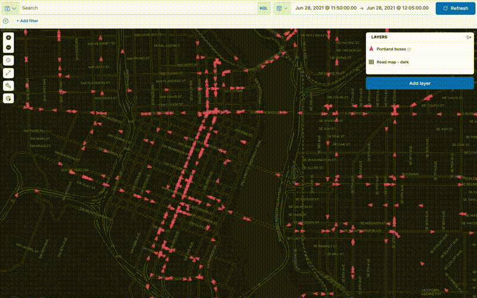

# Images

Images include screenshots, inline images, icons, and more. Syntax for images is like the syntax for links, with the following differences:

1. instead of link text, you provide an image description
2. an image description starts with ` includes an image and is used in pages that exist in different `toc.yml`, the images will break.
:::

## Block-level images

```markdown

```


Or, use the `image` directive.

```markdown
:::{image} ../syntax/images/observability.png
:alt: Elasticsearch
:width: 250px
:::
```

:::{image} ../syntax/images/observability.png
:alt: Elasticsearch
:width: 250px
:::

### Image centering

Images that are not full width are automatically centered within their container. This is particularly useful when you specify a width constraint:

```markdown
:::{image} ../syntax/images/apm.png
:alt: APM Logo
:width: 400px
:::
```

:::{image} ../syntax/images/apm.png
:alt: APM Logo
:width: 400px
:::

The image above is centered because it has a width of 400px, which is less than the full container width.

Note that images nested within other content (like lists or admonitions) are not centered:

- First item in the list
- Second item with an image:

  :::{image} ../syntax/images/apm.png
  :alt: APM Logo in list
  :width: 400px
  :::

- Third item in the list

## Screenshots

Screenshots are images displayed with a box-shadow. Define a screenshot by adding the `:screenshot:` attribute to a block-level image directive.

```markdown
:::{image} ../syntax/images/apm.png
:screenshot:
:::
```

:::{image} ../syntax/images/apm.png
:screenshot:
:::

## Inline images

```markdown
Here is the same image used inline 
```

Here is the same image used inline 

### Inline image titles

Titles are optional making this the minimal syntax required:

```markdown

```

For inline images, the alt text always overrides any title specified in the Markdown. This ensures consistent accessibility where both the `alt` and `title` attributes contain the same descriptive text.

```markdown

```


### Inline image sizing

Image sizing is specified through the title argument. You can specify just the size without needing to provide a redundant title:

```markdown


```

In this case, the alt text will be used as both the `alt` and `title` attributes, and the size parameters will be applied.

`W` and `H` can be either an absolute number in pixels or a number followed by `%` to indicate relative sizing.

If `H` is omitted `W` is used as the height as well.

```markdown


```

When specifying just the size without a title, no space is required before the `=` sign. When combining a title with sizing, a space is required before the `=`:

```markdown
 <!-- Just size, no space needed -->
 <!-- With title, space required -->
```

### SVG

```markdown

```


### GIF

```markdown

```


## Asciidoc syntax

```asciidoc
[role="screenshot"]
image::images/metrics-alert-filters-and-group.png[Metric threshold filter and group fields]
```

```asciidoc
image::images/synthetics-get-started-projects.png[]
```

## Image carousel

The image carousel directive builds upon the image directive.

```markdown
::::{carousel}

:id: nested-carousel-example
:max-height: small ## small, medium, none (none is default if max-height is not specified)

:::{image} images/apm.png
:alt: First image description
:title: First image title
:::

:::{image} images/applies.png
:alt: Second image description

### Title is optional - alt text will be used as title if not specified

:::

::::
```

::::{carousel}

:id: nested-carousel-example
:max-height: small

:::{image} images/apm.png
:alt: First image description
:title: First image title
:::

:::{image} images/applies.png
:alt: Second image description
:title: Second image title
:::

::::
