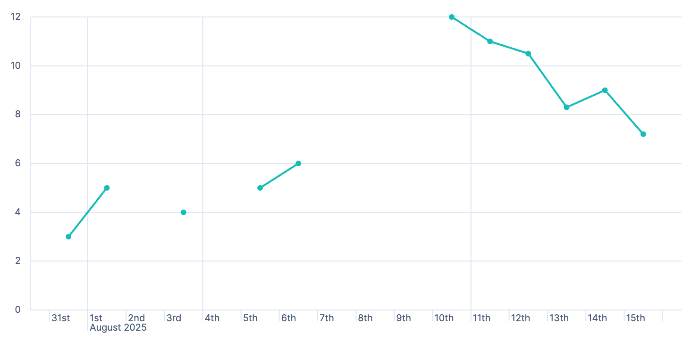
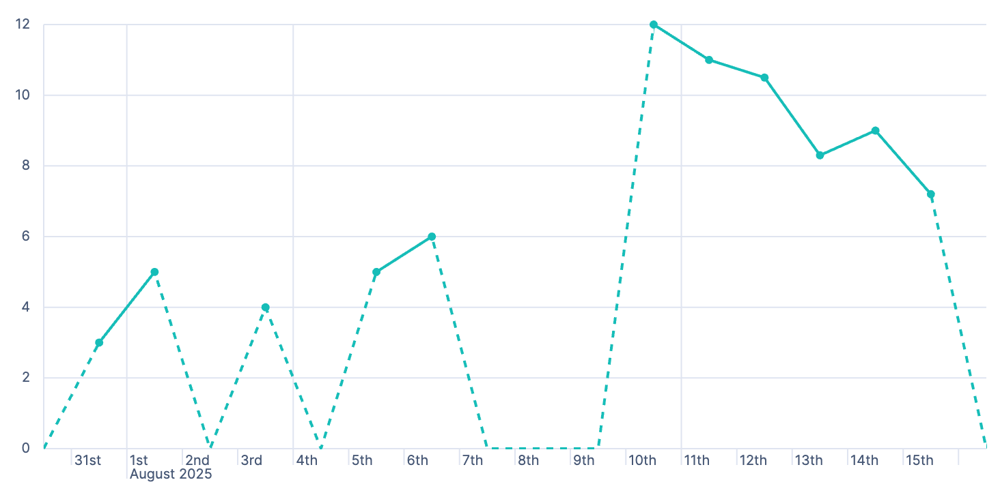
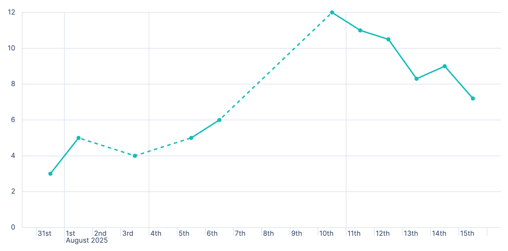
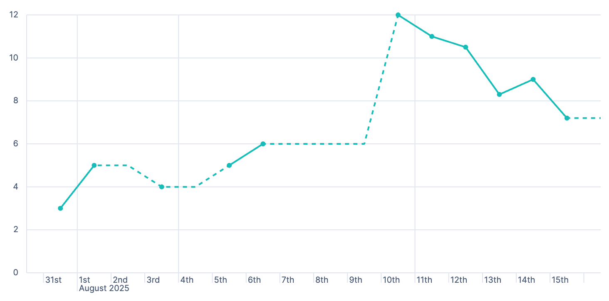

:::{dropdown} Style settings
Adjust the visual appearance of your line chart to control how the data series are labeled and displayed alongside your chart. Click {icon}`brush` to open the **Style** panel.
    
**Appearance**
:   Allow you to customize to overall chart appearance:

  - **Point visibility**: Use this option to show or hide data points. Set to **Auto** by default: Points are visible unless the distance between them is too short.

  - **Line interpolation**: Choose how to interpolate the line between data points from the available options: **Straight** (default), **Smooth**, and **Step**.

  - **Missing values**: Choose between **Hide**, **Zero**, **Linear**, **Last**, and **Next**. This option controls how gaps in data appear on the chart. By default, gaps are hidden. Missing values include empty buckets and metrics: Buckets without documents or metrics that returned `null` due to their operation and data content.
    
    ```{note}
    You can only use this option when the **Include empty rows** option of the chart is enabled or when a metric produces a null bucket. For example, if a moving average finds empty buckets.
    ```
    * **Hide**: Don't show gaps in data.
      
      

    * **Zero**: Fill gaps by connecting starting and ending data points to zero.
      
      

    * **Linear**: Fill gaps by connecting related starting and ending data points together with a direct line.
      
      
    
    * **Last**: Fill gaps between data points with a horizontal or vertical line that uses the last ending point value, when available, to determine its position.
      
      

    * **Next**: Fill gaps between data points with a horizontal or vertical line that uses the next starting point value, when available, to determine its position.
      
      

    **End values**
    :   If you've chosen to show missing values, you can also decide to extend data series to the edge of the chart. By default, end values are hidden.
        
        * **Hide**: Don't extend series to the edge of the chart.
        * **Zero**: Extend series as zero to the edge of the chart.
        * **Nearest**: Extend series with their first or last value to the edge of the chart.

    **Show as dotted line**
    :   If you've chosen to show missing values, you can turn on this option to show gaps as a dotted line.

**Left axis**
:   Allow you to customize the Y-axis appearance. 

  - **Axis Title**. Show, hide or add a custom title. 
  - **Gridlines**. Show or hide gridlines.
  - **Tick labels**. Show or hide tick labels.
  - **Orientation**. Choose the tick labels orientation.
  - **Axis scale**. Choose an axis scale type. Options include: Linear (default), Logarithmic, and Square root.
  - **Bounds**. Use Bounds to set the minimum and maximum values for the Y-axis. Options include: Full, Data, and Custom
  - **Round to nice value**. Axis labels can be rounded to more readable numbers.

**Bottom axis**
:   Allow you to customize the bottom axis appearance:

  - **Axis Title**. Show, hide or add a custom title. 
  - **Gridlines**. Show/hide gridlines.
  - **Tick labels**. Show/hide tick labels.
  - **Show partial data markers**: indicate data points where Data collection is incomplete (the time bucket is still open and actively collecting events), or data may change (the values represented might increase as more data arrives).
  - **Show current time marker**: Add a vertical line on your chart that represents the current time.

:::