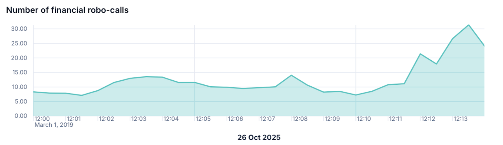

# Build area charts with {{kib}}

An area chart is a type of visualization that displays trends over time with an emphasis on volume or magnitude. Area charts fill the space between the line and the x-axis, creating a colored "area" that visually emphasizes the volume of data.

The best way to create area charts in {{kib}} is with **Lens**.

## When to use area charts

Area charts are particularly effective for showing trends over time when you want to emphasize volume. Use an area chart when you want to:

- Compare multiple related data series
- Visualize parts of a whole changing over time (when stacked)
- Highlight cumulative totals

## Build an area chart

To build an area chart:

:::::{stepper}

::::{step} Access Lens
**Lens** is {{kib}}'s main visualization editor. You can access it:
- By adding a new visualization to a dashboard. To do that, go to the **Dashboards** page and open or create the dashboard where you'd like to add a metric chart.
- By creating a visualization from the **Visualize library** page.
::::

::::{step} Set the visualization to Area
New visualizations default to creating **Bar** charts. 

From the dropdown on the right side, select **Area**.
::::

::::{step} Define the data to show
1. Select the {{data-source}} that contains your data.
2. Select the area chart type: Standard, Stacked, or Percentage.
3. Optionally add a breakdown for multiple areas.

Refer to  to find all data configuration options for your area chart.
::::

::::{step} Save the chart
Save your visualization by selecting **Save and return** if you're adding it from a dashboard, or **Save to library** to use it later.
::::

:::::

### Best practices

Tweak the appearance of the chart to your needs. Consider the following best practices:

**Use appropriate time intervals**
:   Adjust the time bucket size (hourly, daily, weekly) based on your data density. 

**Limit the number of breakdowns**
:   Too many areas can make the chart hard to read. 

**Consider using filters**
:   Pre-filter your data to focus on specific segments.

**Add annotations**
:   Mark important events on your timeline for context.

### Advanced configurations

TBD

## Area chart settings [settings]

Customize your area chart to display exactly the information you need, formatted the way you want.

## Area chart example

The following example show various configuration options that you can use for building impactful area charts.

### E-commerce Revenue Over Time by Category

This example shows you how to create an area chart displaying how much revenue each product category generates daily, with areas stacked to show both individual category performance and total revenue.

- X-axis: `order_date` with "Daily" interval
- Y-axis: `taxful_total_price` with "Sum" aggregation
- Breakdown: `category.keyword`
- Chart type: Stacked area
- Title: "Daily Revenue by Product Category"

[ADD SCREENSHOT]

