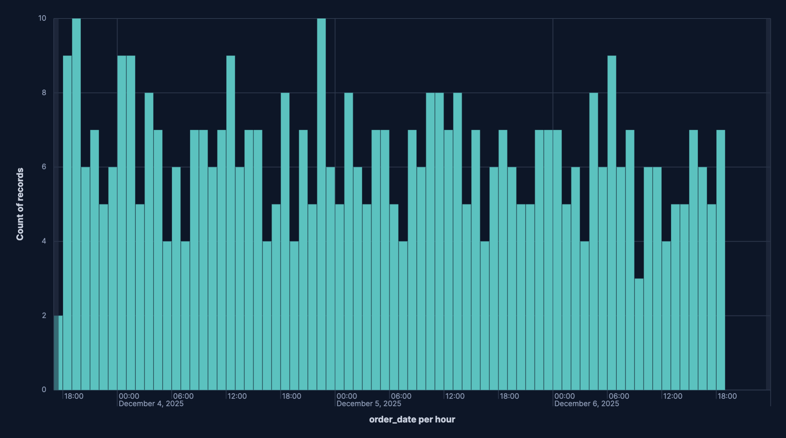
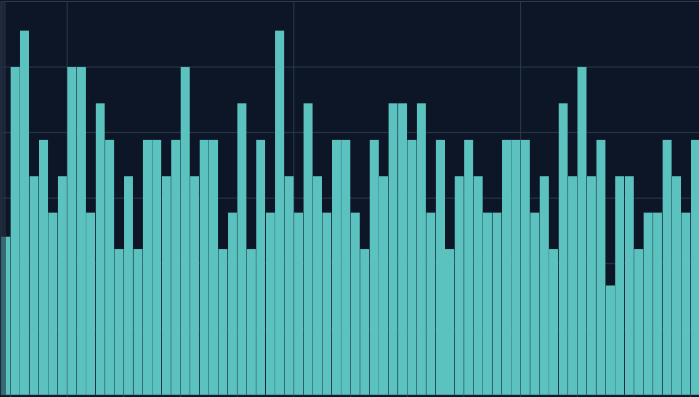
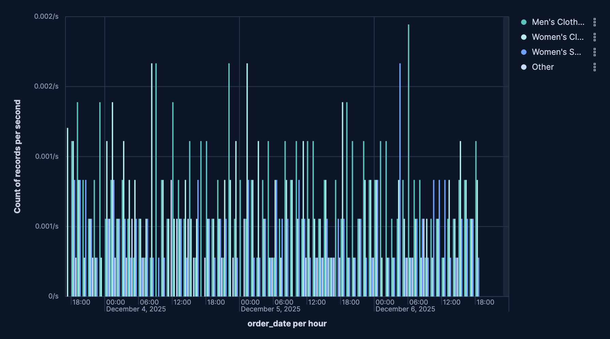

# Build bar charts with {{kib}}

Bar charts are one of the most versatile and widely used visualizations for comparing values across categories. They're perfect for showing distributions, rankings, and comparisons, making complex data understandable at a glance.

They work with any type of data: numeric values, counts, averages, or calculations. You can compare sales by region, track errors by service, analyze user engagement by feature, or rank products by revenue. Using bar charts, you can display data horizontally or vertically, stacked to show part-to-whole relationships, or grouped to compare multiple metrics side by side.

You can create bar charts in {{kib}} using [**Lens**](../lens.md "title =70%").

## Build a bar chart

To build a bar chart:

:::::{stepper}

::::{step} Access Lens
**Lens** is {{kib}}'s main visualization editor. You can access it:
- From a dashboard: On the **Dashboards** page, open or create the dashboard where you want to add a bar chart, then add a new visualization.
- From the **Visualize library** page by creating a new visualization.
::::

::::{step} Set the visualization to Bar
New visualizations default to creating **Bar** charts, so you don't need to change the chart type selection.
::::

::::{step} Define the data to show
1. Select the {{data-source}} that contains your data.
2. Set the **Horizontal axis** to define categories for your data. This is typically a dimension like a category field, date histogram, or terms aggregation. This setting creates the individual bars.
3. Set the **Vertical axis** to define the numerical values or quantities being measured. They're what determines the height or length of your bars. 
4. Optionally:
    - Add a [**Break down by**](#breakdown-options) dimension to split each bar into segments, creating stacked or grouped bar charts.
    - Add multiple metrics to compare different measures side by side.
    - Add layers to your chart to integrate additional visualizations, [annotations](../lens.md#add-annotations), or a [reference line](../lens.md#add-reference-lines).
    - Configure the axis settings to customize scale, labels, and gridlines.

Refer to  for all data configuration options for your bar chart.
::::

::::{step} Customize the chart to follow best practices
Tweak the appearance of the chart to your needs. Consider the following best practices:

**Select appropriate orientation**
:   Use vertical bars for time-based data and horizontal bars when category labels are long or you have many categories to display.

**Use color strategically**
:   Apply colors to distinguish between categories or highlight important values. Use consistent color schemes across related dashboards.

**Keep it focused**
:   Avoid cluttering with too many bars or categories. If you have more than 10-15 categories, consider filtering to show top values or using a different visualization type.

**Label clearly**
:   Use descriptive axis labels and titles. Add value labels when exact numbers are important.

**Sort meaningfully**
:   Sort bars by value (ascending or descending) to make comparisons easier, or keep them in alphabetical/chronological order when the sequence matters.

Refer to  for a complete list of options.
::::

::::{step} Save the chart
- If you accessed Lens from a dashboard, select **Save and return** to save the visualization and add it to that dashboard, or select **Save to library** to add the visualization to the Visualize library and be able to add it to other dashboards later.
- If you accessed Lens from the Visualize library, select **Save**. A menu opens and offers you to add the visualization to a dashboard and to the Visualize library.
::::

:::::

## Advanced bar chart scenarios

### Create stacked bar charts [stacked-bars]

Stacked bar charts show how different components contribute to a total value. Each bar is divided into colored segments representing different categories, allowing you to view both the total and the breakdown.

Stacked bar charts work best when:
- You want to show part-to-whole relationships
- The total value is meaningful
- You have 2-7 segments per bar, more can become hard to read
- The segments don't vary wildly in size

To create a stacked bar chart:

1. Create a **Bar** visualization and set it to **Stacked**.
   :::{tip}
   You can also set it to **Percentage** for a stacked display but as percentages of the total instead, allowing you to compare proportions even when absolute values differ greatly.
   :::
2. Add the main metric you want to visualize to the vertical axis.
3. Add a dimension to the horizontal axis to create the bars.
4. Add a dimension to **Break down by** to split each bar into stacked segments, recognizable with varying colors.

### Create unstacked (side-by-side) bar charts [grouped-bars]

Unstacked bar charts display multiple bars side by side for each category, allowing you to compare different metrics or time periods.

Use unstacked bar charts when:
- You need to compare 2-4 metrics across categories
- Direct comparison between metrics is more important than viewing totals
- The metrics have similar scales

To create an unstacked bar chart:

1. Create a **Bar** chart visualization and set it to **Unstacked**
2. Add the main metric you want to visualize to the vertical axis.
3. Add a dimension to the horizontal axis.
4. Add a dimension to **Break down by** to split each bar into different bars that show next to each other, recognizable with varying colors.

## Bar chart settings [settings]

Customize your bar chart to display exactly the information you need, formatted the way you want.

### Horizontal axis settings [horizontal-axis-options]

**Data**
:   The dimension that creates your individual bars. Common options include:
    - **Date histogram**: Create time-based bars with configurable intervals.
    - **Filters**: Define custom categories using KQL queries.
    - **Intervals**: Group data into numerical ranges.
    - **Top values**: Specify fields for which to gather top values. 

**Appearance**
:   Define the formatting of the horizontal axis, including:
    - **Name**: Customize the axis label to describe what the bars represent.
    - **Value format**: Select to display values as number, percent, bytes, bits, duration, or with a custom format.

### Vertical axis settings [vertical-axis-options]

**Data**
:   The metric that determines the height of your bars. When you drag a field onto the vertical axis, {{kib}} suggests a function based on the field type. You can change it and use aggregation functions like `Sum`, `Average`, `Count`, `Median`, `Min`, `Max`, and more, or create custom calculations with formulas. Refer to  for examples, or to the {icon}`documentation` **Formula reference** available from Lens.

    :::{include} ../../_snippets/lens-value-advanced-settings.md
    :::

**Appearance**
:   Define the formatting of the vertical axis, including:
    - **Name**: By default, the chart uses the function or formula as the axis label. It's a best practice to customize this with a meaningful title.
    - **Value format**: Select to display values as number, percent, bytes, bits, duration, or with a custom format.
    - **Series color**: Assign a specific color to bars.
    - **Axis side**: Choose to display the vertical axis on the left or right side of the graph. By default, the axis displays on the left. 

### Breakdown settings [breakdown-options]

**Data**
:   Split your bars into segments or groups based on another dimension. Each unique value creates its own segment or bar, allowing you to show composition or compare metrics across multiple dimensions. Common options include:
    - **Date histogram**: Create time-based bars with configurable intervals
    - **Filters**: Define custom categories using KQL queries
    - **Intervals**: Group data into numerical ranges
    - **Top values**: Specify fields for which to gather top values 

**Appearance**
:   Define the formatting of the breakdown, including:
    - **Name**: Customize the legend label.
    - **Value format**: Select to display values as number, percent, bytes, bits, duration, or with a custom format.
    - **Color mapping**: Select a color palette or assign specific colors to categories.

### General layout [appearance-options]

When creating or editing a visualization, you can customize several appearance options from the {icon}`brush` **Style** or  **Legend** menus.

**Appearance**
:   Select the bar orientation. It can be **Horizontal** or **Vertical**.

**Titles and text**
:    Specify to hide or show bar values on bar charts:
    - **Hide**: Removes the numeric value from the bars entirely. Only the bar height represents the magnitude. 
    - **Show, if able**: Attempts to draw the value inside each bar, but the label will only render when there’s enough vertical space to keep text legible; crowded bars will not have labels. 
    
    Your selection applies to the entire chart layer, so you can turn labels on for quick KPI-style charts or keep them off for dense histograms.

**Bottom axis**
:   Bottom-axis controls for Lens bar charts let you tune how the horizontal scale looks and behaves. Key options are:
    - **Title**: Set the label that appears under the axis (for example, "Date"). You can hide the label entirely if the layout is tight. 
    - **Gridlines**: Toggles vertical guide lines across the chart, which help compare bar positions against the axis scale.
    - **Tick labels**: Show or hide the textual values beneath the ticks. When visible, the orientation picker lets you rotate them (horizontal, angled, vertical) to avoid overlap on dense timelines.
    - **Orientation**: Set the placement of the bottom axis title. It can be **Horizontal**, **Vertical**, or **Angled**.
    - **Axis scale**: Select linear (default), log, or square-root scaling. Even though this is the bottom axis, it matters for horizontal bar charts or numeric bucketed X-axes.
    - **Bounds & rounding**: Manually clamp the axis to a min/max or let Lens round to nice intervals. For numeric histograms this also controls whether “nice” bucket labels are used.

**Left axis**
:   Left-axis controls for Lens bar charts let you tune how the vertical scale looks and behaves. Key options are:
    - **Title**: Set the label that appears under the axis (for example “Date”); you can hide the label entirely if the layout is tight. 
    - **Gridlines**: Toggles vertical guide lines across the chart, which help compare bar positions against the axis scale.
    - **Tick labels**: Show or hide the textual values beneath the ticks. When visible, the orientation picker lets you rotate them (horizontal, angled, vertical) to avoid overlap on dense timelines.
    - **Orientation**: Set the placement of the bottom axis title. It can be **Horizontal**, **Vertical**, or **Angled**.
    - **Partial data markers**: Highlights buckets at the edges of the time range that only contain partial data—useful for time-based bar charts so viewers know the first/last bucket might be incomplete.
    - **Current time marker**: Draws a vertical marker for “now” on time charts, so you can see how recent the latest bar is.

**Legend**
:   Configure elements of your bar chart's legend. Configurable options include:
    - **Visibility**: Specify whether to automatically show the legend or hide it.
    - **Position**: Choose to show the legend inside or outside the chart, then pick the side (left, right, top, or bottom) and fine-tune alignment (vertical/horizontal) for grid-style layouts.
    - **Width**: Set the width of the legend.
    - **Statistics**: Choose one or more statistic to show (for example, average, min, max, last value), Lens appends those numbers to every series label so you don’t have to hover over the chart to see headline figures.  
    - **Label truncation**: Choose whether to truncate long series labels, and set a limit for how many lines render when it's inside the chart.

## Bar chart examples

The following examples show various configuration options that you can use for building impactful bar charts.

**Monthly website traffic by source**
:   Track website visits over time, broken down by traffic source:

    * **Title**: "Monthly Website Traffic by Source"
    * **Vertical axis**: `count()`
      * **Name**: "Page Views"
      * **Value format**: `Number`
    * **Horizontal axis**: `date_histogram(timestamp, interval='1M')`
      * **Name**: "Month"
    * **Break down by**: `terms(traffic_source)`
      * **Number of values**: `5`
      * **Colors**: Custom palette (Organic=green, Paid=blue, Social=purple, Direct=orange, Referral=teal)
    * **Layout**: `Stacked`
    * **Legend**: Right side, showing traffic source

**Error rate by service (with threshold)**
:   Monitor error rates across microservices with a target threshold line:

    * **Title**: "Error Rate by Service"
    * **Vertical axis**: `count(kql='log.level: "error"') / count() * 100`
      * **Name**: "Error Rate %"
      * **Value format**: `Percent`
      * **Color by value**: Dynamic coloring (green below 1%, yellow 1-5%, red above 5%)
    * **Horizontal axis**: `terms(service.name)`
      * **Name**: "Service"
      * **Number of values**: `15`
      * **Sort by**: Error rate descending
    * **Reference line**: Value `5` (5% threshold)
      * **Label**: "Maximum acceptable error rate"
      * **Color**: Red, dashed line
    * **Layout**: Horizontal orientation (for better service name readability)

**Resource usage comparison across regions**
:   Compare CPU, memory, and disk usage across different geographic regions:

    * **Title**: "Resource Usage by Region"
    * **Vertical axis**: Multiple metrics:
      * `average(cpu_usage_percent)` - Name: "CPU %"
      * `average(memory_usage_percent)` - Name: "Memory %"
      * `average(disk_usage_percent)` - Name: "Disk %"
      * **Value format**: `Percent`
    * **Horizontal axis**: `terms(cloud.region)`
      * **Name**: "Region"
      * **Number of values**: `8`
    * **Layout**: `Clustered` (side by side)
    * **Colors**: Different color for each metric
    * **Legend**: Show at top with metric names

**E-commerce conversion funnel**
:   Display conversion rates at each stage of the purchase funnel:

    * **Title**: "Conversion Funnel - Homepage to Purchase"
    * **Vertical axis**: Custom formulas for each stage:
      * `count(kql='page.name: "homepage"')` - 100%
      * `count(kql='page.name: "product"')` - Product views
      * `count(kql='page.name: "cart"')` - Add to cart
      * `count(kql='event.type: "purchase"')` - Purchases
    * **Horizontal axis**: `filters()` with custom labels:
      * "Homepage Visits"
      * "Product Views"
      * "Added to Cart"
      * "Completed Purchase"
    * **Value format**: Show both count and percentage
    * **Layout**: Basic bars with gradient colors (green to blue)
    * **Sort**: Keep in funnel order (not by value)

    ::::{tip}
    Add value labels on bars showing both the count and the percentage drop-off from the previous stage to make conversion rates immediately visible.
    ::::

**Customer satisfaction scores by department**
:   Show average satisfaction ratings for different departments with target line:

    * **Title**: "Customer Satisfaction by Department (Q4 2024)"
    * **Vertical axis**: `average(satisfaction_score)`
      * **Name**: "Average Rating"
      * **Value format**: `Number` with 1 decimal place
      * **Axis bounds**: Custom (0 to 5)
    * **Horizontal axis**: `terms(department)`
      * **Name**: "Department"
      * **Sort by**: Alphabetical
    * **Break down by**: `terms(satisfaction_category)` with 3 values: "Promoter", "Passive", "Detractor"
    * **Layout**: `Percentage mode` to show proportion of each rating category
    * **Reference line**: Value `4.0` for target satisfaction score
      * **Label**: "Target"
      * **Color**: Green, solid line
    * **Colors**: Promoter=green, Passive=yellow, Detractor=red