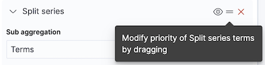

# Build bar charts with {{kib}}

Bar charts are one of the most versatile and widely used visualizations for comparing values across categories. They're perfect for showing distributions, rankings, and comparisons—making complex data understandable at a glance.

They work with any type of data: numeric values, counts, averages, or calculations. You can compare sales by region, track errors by service, analyze user engagement by feature, or rank products by revenue. Using bar charts, you can display data horizontally or vertically, stacked (to show part-to-whole relationships), or grouped (to compare multiple metrics side by side).

You can create bar charts in {{kib}} using [**Lens**](../lens.md).

## Build a bar chart

To build a bar chart:

:::::{stepper}

::::{step} Access Lens
**Lens** is {{kib}}'s main visualization editor. You can access it:
- From a dashboard: On the **Dashboards** page, open or create the dashboard where you want to add a bar chart, then add a new visualization.
- From the **Visualize library** page by creating a new visualization.
::::

::::{step} Set the visualization to Bar
New visualizations default to creating **Bar** charts, so you don't need to change the chart type selection.
::::

::::{step} Define the data to show
1. Select the {{data-source}} that contains your data.
2. Set the **Horizontal axis** (for vertical bar charts) or the **Vertical axis** (for horizontal bar charts) to define categories for your data. This is typically a dimension like a category field, date histogram, or terms aggregation. This setting creates the individual bars.
3. Set the **Vertical axis** (for vertical bar charts) or the **Horizontal axis** (for horizontal bar charts) to define the numerical values or quantities being measured. This metric determines the height or length of your bars. 

4. Optionally:
    - Add a [**Break down by**](#breakdown-options) dimension to split each bar into segments, creating stacked or grouped bar charts.
    - Add multiple metrics to compare different measures side by side.
    - Configure the axis [settings](#settings) to customize scale, labels, and gridlines.

Refer  for all data configuration options for your bar chart.
::::

::::{step} Customize the chart to follow best practices
Tweak the appearance of the chart to your needs. Consider the following best practices:

**Select appropriate orientation**
:   Use vertical bars for time-based data and horizontal bars when category labels are long or you have many categories to display.

**Use color strategically**
:   Apply colors to distinguish between categories or highlight important values. Use consistent color schemes across related dashboards.

**Keep it focused**
:   Avoid cluttering with too many bars or categories. If you have more than 10-15 categories, consider filtering to show top values or using a different visualization type.

**Label clearly**
:   Use descriptive axis labels and titles. Add value labels when exact numbers are important.

**Sort meaningfully**
:   Sort bars by value (ascending or descending) to make comparisons easier, or keep them in alphabetical/chronological order when the sequence matters.

Refer to  for a complete list of options.
::::

::::{step} Save the chart
- If you accessed Lens from a dashboard, select **Save and return** to save the visualization and add it to that dashboard, or select **Save to library** to add the visualization to the Visualize library and be able to add it to other dashboards later.
- If you accessed Lens from the Visualize library, select **Save**. A menu opens and offers you to add the visualization to a dashboard and to the Visualize library.
::::

:::::

## Advanced bar chart scenarios

### Create stacked bar charts [stacked-bars]

Stacked bar charts show how different components contribute to a total value. Each bar is divided into colored segments representing different categories, allowing you to view both the total and the breakdown.

To create a stacked bar chart:

1. Create a **Bar** visualization with your metric on the vertical axis.
2. Add a dimension to the horizontal axis (this creates your bars).
3. Add a second dimension to **Break down by**. This splits each bar into stacked segments.
4. In the chart settings, ensure **Stacked** is selected under the layout options.

::::{tip}
Stacked bar charts work best when:
- You want to show part-to-whole relationships
- The total value is meaningful
- You have 2-7 segments per bar (more becomes hard to read)
- The segments don't vary wildly in size
::::

% Need to update the following images.

| Basic bar chart | Stacked bar chart |
|--------|-------|
|  |  |

% ### Create grouped (side-by-side) bar charts [grouped-bars]

% Grouped bar charts display multiple bars side by side for each category, allowing you to compare different metrics or time periods.

% To create a grouped bar chart:

% 1. Create a **Bar** chart visualization with your first metric on the vertical axis.
% 2. Add a dimension to the horizontal axis.
% 3. Add a second dimension to **Break down by**.
% 4. In the chart settings, select **Clustered** or **Side by side** under the layout options (instead of Stacked).

% ::::{tip}
% Use grouped bar charts when:
% - You need to compare 2-4 metrics across categories
% - Direct comparison between metrics is more important than viewing totals
% - The metrics have similar scales
% ::::

### Show trends with time-based bar charts [time-bars]

Bar charts excel at showing trends over time when you need to compare specific time periods or view the distribution of values.

To create a time-based bar chart:

1. Create a **Bar** chart visualization.
2. Set the **Vertical axis** to your metric (like count, sum, or average).
3. Set the **Horizontal axis** to a date field using the **Date histogram** function.
4. Configure the minimal time interval (auto, millisecond, second, minute, hour, day, week, month, year).
5. Optionally add a [**Break down by**](#breakdown-options) dimension to split each bar into segments, creating stacked or grouped bar charts.

::::{tip}
Time-based bar charts are great for:
- Comparing values across discrete time periods
- Showing seasonal patterns or cyclical trends
- Highlighting specific days, weeks, or months
- When the exact values for each period matter

For continuous trends, consider using a line chart instead.
::::

### Add reference lines and annotations [reference-lines]

% Need to write instructions for annotations. They were not auto-created.

Reference lines help viewers understand context by showing thresholds, goals, or averages directly on your bar chart.

To add a reference line:

1. Create a **Bar** chart visualization.
2. Click **Add layer** select the **Reference lines** layer type, then choose the {{data-source}}.
3. (Optional) Configure the vertical left axis. By default, **Static value** is selected and a reference line is placed at a fixed coordinate on the chart’s vertical left axis. You can also configure the **Reference line value**, which sets the numeric position of the x-axis line. To have the value computed instead, select **Quick function** or **Formula**.
4. Configure the refernece line's appearance:
   - **Name**: The name of the reference line that you're creating  
   - **Value format**: Controls how any label for the line is displayed (default formatting or other available numeric/date formats)
   - **Text decoration**: Selects whether the label shows nothing or the line’s name
   - **Icon decoration**: Allows adding a glyph next to the label
   - **Line**: Sets stroke width (1 px) plus pattern (solid or dashed)
   - **Fill**: Decides whether to shade the area above or below the reference line. None leaves the area unfilled
   - **Color**: Sets the line (and fill) color

Common reference line uses:
- **Goals**: Show sales targets, SLA thresholds, or performance benchmarks
- **Averages**: Display mean or median values for comparison
- **Limits**: Indicate maximum capacity or acceptable ranges

### Use percentage mode for relative comparisons [percentage-mode]

Percentage mode converts your bar values to percentages of the total, allowing you to compare proportions even when absolute values differ greatly.

To enable percentage mode:

1. Create a stacked bar chart with multiple categories.
% How do users add multiple categories?
2. In the **Vertical axis** appearance settings, find the **Value format** option.
3. Select **Percent**. 

Each bar now shows segments as percentages of that bar's total (summing to 100%).

::::{tip}
Use percentage mode when:
- Relative proportions matter more than absolute values
- You're comparing composition across categories with different totals
- Showing market share, demographic breakdown, or category distribution
::::

## Bar chart settings [settings]

Customize your bar chart to display exactly the information you need, formatted the way you want.

### Horizontal axis settings [horizontal-axis-options]

**Data**
:   The dimension that creates your individual bars. Common options include:
    - **Date histogram**: Create time-based bars with configurable intervals
    - **Filters**: Define custom categories using KQL queries
    - **Intervals**: Group data into numerical ranges
    - **Top values**: Specify fields for which to gather top values 

**Appearance**
:   Define the formatting of the horizontal axis, including:
    - **Name**: Customize the axis label to describe what the bars represent.
    - **Value format**: Select to display values as number, percent, bytes, bits, duration, or with a custom format.

### Vertical axis settings [vertical-axis-options]

**Data**
:   The metric that determines the height of your bars. When you drag a field onto the vertical axis, {{kib}} suggests a function based on the field type. You can change it and use aggregation functions like `Sum`, `Average`, `Count`, `Median`, `Min`, `Max`, and more, or create custom calculations with formulas. Refer to  for examples, or to the {icon}`documentation` **Formula reference** available from Lens.

    :::{include} ../../_snippets/lens-value-advanced-settings.md
    :::

**Appearance**
:   Define the formatting of the vertical axis, including:
    - **Name**: By default, the chart uses the function or formula as the axis label. It's a best practice to customize this with a meaningful title.
    - **Value format**: Select to display values as number, percent, bytes, bits, duration, or with a custom format.
    - **Series color**: ?
    - **Axis side**: Choose to display the veritical axis on the left or right side of the graph. By default, the axis displays on the left. 

### Break down by settings [breakdown-options]

**Data**
:   Split your bars into segments or groups based on another dimension. Each unique value creates its own segment or bar, allowing you to show composition or compare metrics across multiple dimensions. Common options include:
    - **Date histogram**: Create time-based bars with configurable intervals
    - **Filters**: Define custom categories using KQL queries
    - **Intervals**: Group data into numerical ranges
    - **Top values**: Specify fields for which to gather top values 

    :::{include} ../../_snippets/lens-breakdown-advanced-settings.md
    :::

**Appearance**
:   Define the formatting of the breakdown, including:
    - **Name**: Customize the legend label.
    - **Value format**: Select to display values as number, percent, bytes, bits, duration, or with a custom format.
    - **Color mapping**: Select a color palette or assign specific colors to categories.

### General chart settings [appearance-options]

When creating or editing a visualization, you can customize several appearance options. Look for the {icon}`brush` icon to access these settings.

**Layout**
% This is not available from the menu that you access when clicking the brush icon.
:   Select how to display your bar chart:
    - **Stacked**: Bars are divided into segments stacked on top of each other, showing part-to-whole relationships.
    - **Percentage**: Similar to stacked, but normalized to 100% to show relative proportions.
    - **Clustered** or **Side by side**: Multiple metrics appear as separate bars grouped together for each category.

**Orientation**
:   Switch between:
    - **Vertical bars**: Categories on the X-axis, values on the Y-axis (default)
    - **Horizontal bars**: Categories on the Y-axis, values on the X-axis (better for long labels or many categories)

**Color and styling**
:   Define colors, bar spacing, and other visual properties:
    - **Color by**: Apply colors by category or value ranges
    - **Color palette**: Select from predefined palettes or create custom colors
    - **Bar spacing**: Adjust the gap between bars for visual clarity
    - **Missing values**: Select how to handle gaps in your data

**Labels**
:   Control value labels on bars:
    - **Show values**: Display the numeric value on each bar
    - **Label position**: Inside, outside, or automatic placement
    - **Label format**: Customize number formatting for labels

## Bar chart examples

The following examples show various configuration options that you can use for building impactful bar charts.

**Sales by product category**
:   Display total sales broken down by product category to identify top performers:

    * **Title**: "Total Sales by Product Category"
    * **Vertical axis**: `sum(sales_amount)`
      * **Name**: "Total Sales"
      * **Value format**: `Currency` with `$` prefix
      * **Sort by**: `Value` in descending order
    * **Horizontal axis**: `terms(product_category)`
      * **Name**: "Product Category"
      * **Number of values**: `10`
    * **Layout**: Basic (unstacked)

    

**Monthly website traffic by source**
:   Track website visits over time, broken down by traffic source:

    * **Title**: "Monthly Website Traffic by Source"
    * **Vertical axis**: `count()`
      * **Name**: "Page Views"
      * **Value format**: `Number`
    * **Horizontal axis**: `date_histogram(timestamp, interval='1M')`
      * **Name**: "Month"
    * **Break down by**: `terms(traffic_source)`
      * **Number of values**: `5`
      * **Colors**: Custom palette (Organic=green, Paid=blue, Social=purple, Direct=orange, Referral=teal)
    * **Layout**: `Stacked`
    * **Legend**: Right side, showing traffic sources

    

**Error rate by service (with threshold)**
:   Monitor error rates across microservices with a target threshold line:

    * **Title**: "Error Rate by Service"
    * **Vertical axis**: `count(kql='log.level: "error"') / count() * 100`
      * **Name**: "Error Rate %"
      * **Value format**: `Percent`
      * **Color by value**: Dynamic coloring (green below 1%, yellow 1-5%, red above 5%)
    * **Horizontal axis**: `terms(service.name)`
      * **Name**: "Service"
      * **Number of values**: `15`
      * **Sort by**: Error rate descending
    * **Reference line**: Value `5` (5% threshold)
      * **Label**: "Maximum acceptable error rate"
      * **Color**: Red, dashed line
    * **Layout**: Horizontal orientation (for better service name readability)

**Resource usage comparison across regions**
:   Compare CPU, memory, and disk usage across different geographic regions:

    * **Title**: "Resource Usage by Region"
    * **Vertical axis**: Multiple metrics:
      * `average(cpu_usage_percent)` - Name: "CPU %"
      * `average(memory_usage_percent)` - Name: "Memory %"
      * `average(disk_usage_percent)` - Name: "Disk %"
      * **Value format**: `Percent`
    * **Horizontal axis**: `terms(cloud.region)`
      * **Name**: "Region"
      * **Number of values**: `8`
    * **Layout**: `Clustered` (side by side)
    * **Colors**: Different color for each metric
    * **Legend**: Show at top with metric names

**E-commerce conversion funnel**
:   Display conversion rates at each stage of the purchase funnel:

    * **Title**: "Conversion Funnel - Homepage to Purchase"
    * **Vertical axis**: Custom formulas for each stage:
      * `count(kql='page.name: "homepage"')` - 100%
      * `count(kql='page.name: "product"')` - Product views
      * `count(kql='page.name: "cart"')` - Add to cart
      * `count(kql='event.type: "purchase"')` - Purchases
    * **Horizontal axis**: `filters()` with custom labels:
      * "Homepage Visits"
      * "Product Views"
      * "Added to Cart"
      * "Completed Purchase"
    * **Value format**: Show both count and percentage
    * **Layout**: Basic bars with gradient colors (green to blue)
    * **Sort**: Keep in funnel order (not by value)

    ::::{tip}
    Add value labels on bars showing both the count and the percentage drop-off from the previous stage to make conversion rates immediately visible.
    ::::

**Customer satisfaction scores by department**
:   Show average satisfaction ratings for different departments with target line:

    * **Title**: "Customer Satisfaction by Department (Q4 2024)"
    * **Vertical axis**: `average(satisfaction_score)`
      * **Name**: "Average Rating"
      * **Value format**: `Number` with 1 decimal place
      * **Axis bounds**: Custom (0 to 5)
    * **Horizontal axis**: `terms(department)`
      * **Name**: "Department"
      * **Sort by**: Alphabetical
    * **Break down by**: `terms(satisfaction_category)` with 3 values: "Promoter", "Passive", "Detractor"
    * **Layout**: `Percentage mode` to show proportion of each rating category
    * **Reference line**: Value `4.0` for target satisfaction score
      * **Label**: "Target"
      * **Color**: Green, solid line
    * **Colors**: Promoter=green, Passive=yellow, Detractor=red

