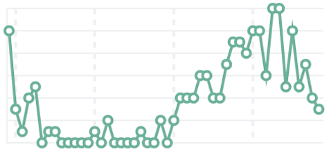

# Build line charts with {{kib}}

Line charts are ideal for visualizing how metrics evolve over time, spotting seasonal patterns, and detecting spikes or regressions at a glance. Use them for KPIs like response time, error rate, throughput, or utilization, and compare multiple series or previous periods on the same chart.

You can create line charts from any numeric data using aggregations (for example, `Average`, `Percentile`, `Counter rate`) or with custom [formulas](../lens.md#lens-formulas). Line charts usually show time on the x-axis, but they can also display data grouped by numbers or categories.

You can create line charts in {{kib}} using [**Lens**](../lens.md).

## Build a line chart

To build a line chart:

::::::{stepper}

:::::{step} Access Lens
**Lens** is {{kib}}'s main visualization editor. You can access it:
- From a dashboard: On the **Dashboards** page, open or create the dashboard where you want to add a line chart, then add a new visualization.
- From the **Visualize library** page by creating a new visualization.
:::::

:::::{step} Set the visualization to Line
New visualizations default to **Bar**.

Using the visualization type dropdown, select **Line**.
:::::

:::::{step} Define the data to show
1. Select the {{data-source}} that contains your data.
2. Drag a time field to the **Horizontal axis** and a numeric field to the **Vertical axis**. {{kib}} automatically selects an appropriate aggregation function compatible with the selected field.

  :::{note}
  You might need to extend the time range and set the time filter to **Last 30 days**.
  :::

Optionally:
   - Add more numeric fields to create additional series, or drag a categorical field to **Break down by** to split the series.
   - Add a [reference line](../lens.md#add-reference-lines) to mark targets or SLOs.
:::::

:::::{step} Customize the chart to follow best practices
You can tweak the appearance of your chart by adjusting axes, legends, and series styles from the chart settings. Consider the following best practices:

**Use color wisely**
:   Assign colors that match your users' expectations and consider your specific context.

**Provide context**
:   Add descriptive axis titles and units to explain what the chart shows.

For layout, hierarchy, and color guidance on dashboards, check the EUI’s [Dashboard good practices](https://eui.elastic.co/docs/dataviz/dashboard-good-practices/). 
For more chart configuration options, go to the [Line chart settings](#settings) section.
:::::

:::::{step} Save the chart
- If you accessed Lens from a dashboard, select **Save and return** to save the visualization and add it to that dashboard, or select **Save to library** to add the visualization to the Visualize library.
- If you accessed Lens from the Visualize library, select **Save**. The Save menu also lets you add the visualization to a dashboard and the Visualize library.
:::::

::::::

## Advanced line scenarios

### Compare with a previous period [line-previous-period]
Compare the current value with a prior time range using time shift to quickly see deltas.

1. Create a line series for the current value, for example: `average(response_time)`.
2. Add a second series with a time shift, for example: `average(response_time, shift='1w')`.
3. Use the legend labels to clarify “Current” versus “Previous (1w)”.

| Single series | With previous period |
|---|---|
|  |  |

::::{tip}
You can also compute the relative change as a separate series using a formula, for example:  
`(average(response_time) - average(response_time, shift='1w')) / average(response_time, shift='1w')`
:::: 

### Highlight thresholds with reference lines [line-reference-lines]
Use reference lines to indicate SLOs or alert thresholds.

1. In the chart settings, add a **Reference line** (for example, `200` ms or `0.95`).
2. Give it a label (for example, `Target` or `SLO`), choose a color, and optionally a band.

## Line chart settings [settings]

Customize your line chart to display exactly the information you need, formatted the way you want.

### Horizontal axis settings [horizontal-axis-settings]

**Data**
:   **Functions**: Allow you to group your data. For example, you can use `Date histogram` to group data points into time-based buckets, or `Intervals` to group values along specific numeric ranges.
:   **Field**: Determines which field from your data will be used for the horizontal axis.
:   **Minimum interval**: Controls the granularity of your time buckets.

**Appearance**
:   **Name**: By default, the chart uses the function or formula as title. It's a best practice to customize this with a meaningful title.

### Vertical axis settings [vertical-axis-settings]

**Data**
:   Represents the metrics or values you want to visualize. You can use quick functions like `Average`, `Count`, `Percentile`, `Counter rate`, or create custom calculations with formulas. Refer to  for examples, or to the {icon}`documentation` **Formula reference** available from Lens.

    :::{include} ../../_snippets/line-vertical-axis-advanced-settings.md
    :::

**Appearance**
:   Define the series style, including:
   - **Name**: Customize the legend label with a descriptive name.
   - **Value format**: Line or area variants, with optional stacking for area.
   - **Series color**: Select a palette or specific color per series.
   - **Axis side**: Control where axis labels and tick marks appear.

### Breakdown (split series) [breakdown-options]

The Breakdown bucket lets you compare trends across different categories within the same visualization.

### General layout [appearance-options]
When creating or editing a visualization, open the {icon}`brush` panel to adjust:

- **Title and subtitle**: Add context like “Last 24 hours”.
- **Axes**: Set titles, units, scale (linear/log/percentage), and grid lines.
- **Legend**: Position and truncation.
- **Tooltip**: Synchronized tooltips are enabled by default across panels on dashboards.

## Line chart examples

**Website response time (p95) with target**
:   Monitor user experience and enforce SLO:

   * **Title**: "Response time (p95)"
   * **X-axis**: `Date histogram` on `@timestamp`
   * **Y-axis**: `percentile(response_time, percentile=95)`
     * **Format**: `Duration`
   * **Reference line**: `200` ms labeled `SLO`

   

**Requests throughput with moving average**
:   Smooth per-minute variation while preserving overall trend:

   * **Title**: "Requests per minute"
   * **X-axis**: `Date histogram`
   * **Y-axis (raw)**: `counter_rate(requests)`
   * **Y-axis (smoothed)**: `moving_average(counter_rate(requests), window=5)`
   * **Legend**: "Raw", "5-interval MA"

   

**Error rate versus previous week**
:   Quickly assess regressions:

   * **Title**: "Error rate (now versus previous week)"
   * **X-axis**: `Date histogram`
   * **Series A**: `count(kql='response.code >= 500') / count()`
     * **Format**: `Percent`
   * **Series B**: `count(kql='response.code >= 500', shift='1w') / count(shift='1w')`
     * **Format**: `Percent`
   * **Legend**: "Current", "Previous (1w)"

   

**Throughput by top countries**
:   Break down by top N categories:

   * **Title**: "Requests per minute by country"
   * **X-axis**: `Date histogram`
   * **Y-axis**: `counter_rate(requests)`
   * **Break down by**: `geo.country`
     * **Number of values**: `10`
     * **Rank by**: `Custom` > `Count` > `Records`

   

---

