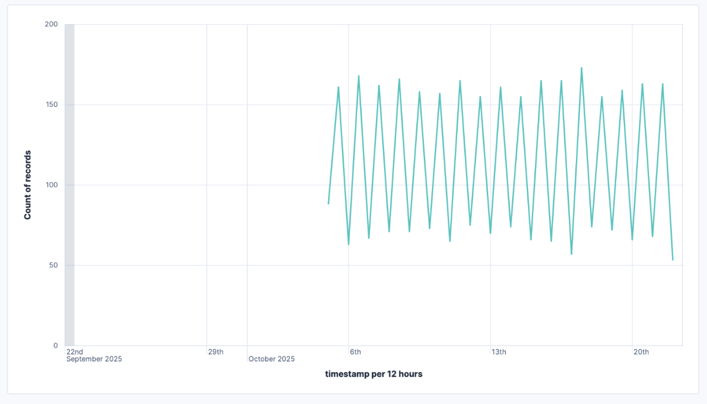

# Build line charts with {{kib}}

A line chart is a type of visualization that displays information as a series of data points connected by straight line segments.

The best way to create line charts in {{kib}} is with **Lens**.

## When to use line charts

Line charts are particularly effective for showing how trends, patterns, and changes in data evolve over time. Use a line chart when you want to:

- Emphasize trends rather than individual values.
- Track multiple related metrics that need comparison.
- Spot patterns or anomalies in time-series data.

## Build a line chart

To build a line chart:

:::::{stepper}

::::{step} Access Lens
**Lens** is {{kib}}'s main visualization editor. You can access it:
- By adding a new visualization to a dashboard. To do that, go to the **Dashboards** page and open or create the dashboard where you'd like to add a metric chart.
- By creating a visualization from the **Visualize library** page.
::::

::::{step} Set the visualization to Line
New visualizations default to creating **Bar** charts. 

From the dropdown on the right side, select **Line**.
::::

::::{step} Define the data to show
1. Select the {{data-source}} that contains your data.
2. Define the timestamp field for the X-axis and one or more numeric fields for the Y-axis.
3. Optionally add a breakdown to segment your data by a specific field, creating multiple lines on your chart instead of just one.

Refer to  to find all data configuration options for your line chart.
::::

::::{step} Save the chart
Save your visualization by selecting **Save and return** if you're adding it from a dashboard, or **Save to library** to use it later.
::::

:::::

### Best practices

Tweak the appearance of the chart to your needs. Consider the following best practices:

**Use color wisely**
:   Assign colors that match your users' expectations. 

**Format for readability**
:   Round to appropriate precision. 

**Provide context**
:   TBD

### Advanced configurations

TBD

## Line chart settings [settings]

Customize your line chart to display exactly the information you need, formatted the way you want.

## Line chart examples

The following examples show various configuration options that you can use for building impactful line charts.

