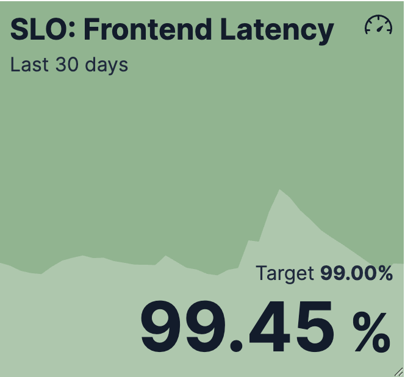

# Build metric charts with {{kib}}

Metric charts make important single values stand out on a dashboard. They're perfect for highlighting KPIs like total sales, active users, or error rates. They can show a plain number, a percentage, or a calculation like a count, sum, or average.

Metric charts are the best visualization when you need to show a single, important value and make it visible.

The best way to create metric charts in {{kib}} is with **Lens**.



## Requirements

Metric charts work with any numeric data. That data can directly come from numeric fields in your data, or be the result of aggregations or formulas.

## Build a metric chart

To build a metric chart:

:::::{stepper}

::::{step} Access Lens
**Lens** is {{kib}}'s main visualization editor. You can access it:
- By adding a new visualization to a dashboard. To do that, go to the **Dashboards** page and open or create the dashboard where you'd like to add a metric chart.
- By creating a visualization from the **Visualize library** page.
::::

::::{step} Set the visualization to Metric
New visualizations suggest to create **Bar** charts by default. 

Using the dropdown indicating **Bar**, select **Metric**.
::::

::::{step} Define the data to show
1. Select the {{data-source}} that contains your data.
2. Define the **Primary metric** by dragging a field from the fields list to the chart. {{kib}} automatically selects an appropriate aggregation function like Sum, Average, or Count based on the field type. This is the only setting that your metric chart requires to display something.
3. Optionally, add a secondary metric. You can use this secondary metric as a comparison value or as a trend indicator to show how the primary metric evolves over time.

Refer to [](#settings) to find all data configuration options for your metric chart.
::::

::::{step} Customize the appearance of the chart
Tweak the appearance of the chart to your needs. Consider the following best practices:

**Use color wisely**
:   Assign colors that match your users' expectations. Red typically means problems, yellow means caution, and green means good. But consider your specific context: for costs, lower might be better (green), while for revenue, higher is better (green).

**Format for readability**
:   Round to appropriate precision. Showing 1.2M is clearer than 1,234,567.89 for high-level metrics. But show more precision when small changes matter.

**Provide context**
:   Use titles and subtitles to explain what the metric means. "45,234" is a number, but "Active Users" as a title gives it meaning, and "Last 24 hours" as a subtitle makes it unambiguous.

Refer to [](#settings) for a complete list of options.
::::

::::{step} Save the chart
Save your visualization by selecting **Save and return** if you're adding it from a dashboard, or **Save to library** to use it later.
::::

:::::

## Examples

Here are common patterns you can adapt for your own data.

**Executive dashboard KPI**
:   Display total revenue as a prominent number on an executive dashboard:

    * **Primary metric**: `sum(sales.revenue)`
    * **Value format**: Currency with 1 decimal place
    * **Title**: "Total Revenue"
    * **Subtitle**: "Current Quarter"
    * **Color by value**: Green when above target, red when below

**Website traffic with trend**
:   Monitor current traffic and show whether it's increasing or decreasing compared to the previous period:

    * **Primary metric**: `count()` (current week's page views)
    * **Secondary metric**: `count(shift='1w')` (previous week's page views)
      * **Trend indicator**: Dynamic coloring enabled
      * **Compare to**: Primary metric
      * **Display**: Both icon and value
      * **Color palette**: Green for increases (more traffic is positive)
    * **Title**: "Weekly Page Views"

**System performance by service**
:   Compare response times across multiple services using breakdown:

    * **Primary metric**: `average(response_time_ms)`
    * **Break down by**: `service.name`
    * **Value format**: Number with suffix "ms"
    * **Title**: "Average Response Time"
    * **Color mapping**: Assign consistent colors to each service name
    * **Color by value**: Red above 500ms, yellow between 200-500ms, green below 200ms

**Error rate with formula**
:   Calculate and display error percentage using a formula:

    * **Primary metric formula**: `count(kql='status_code >= 400') / count() * 100`
    * **Value format**: Percent with 2 decimals
    * **Title**: "Error Rate"
    * **Color by value**: Green below 1%, yellow between 1-5%, red above 5%

**Capacity utilization**
:   Show current usage against maximum capacity:

    * **Primary metric**: `average(system.memory.used.bytes)`
    * **Maximum**: `average(system.memory.total.bytes)`
    * **Value format**: Bytes
    * **Title**: "Memory Usage"
    * **Color by value** (Percent mode): Green 0-70%, yellow 70-90%, red above 90%

**Multi-service comparison**
:   Create a comprehensive view with multiple services side-by-side:

    * **Primary metric**: `count()`
    * **Break down by**: `service.name`
    * **Value format**: Number, compact values enabled
    * **Title**: "Request Volume by Service"
    * **Subtitle**: "Last Hour"
    * **Color mapping**: Assign brand colors to each service for consistency

## Advanced configurations

### Show trends in Metric charts [metric-trends]
```{applies_to}
stack: ga 9.1
serverless: ga
```

When creating **Metric** visualizations with numeric data, you can add trend indicators that compare your primary metric to a secondary value. This feature displays colored badges with directional arrows to help you quickly identify whether values are increasing, decreasing, or staying the same.

| Without trend | With trend |
|--------|-------|
|  |  |

To add trend indicators to your metric visualization:

1. Create a **Metric** visualization with a numeric primary metric.
2. Add a secondary metric that represents the comparison value.

    ::::{tip}
    Use the `shift` parameter in formulas to compare current values against historical data. For example, if your primary metric is counting orders (based on an `order_id` field) for the current week, you can use the `count(order_id, shift='1w')` formula to compare this week's count of orders to last week's count.
    ::::

3. In the secondary metric configuration, look for the **Color by value** option. The possible choices are:
   * **None**: No trend indicators (default)
   * **Static**: Shows the secondary metric as a badge with a single color that you select
   * **Dynamic**: Enables both color coding and directional icons based on the comparison

4. Select **Dynamic** coloring. More options appear.

5. Choose a **Color palette** that matches how you'd like to represent the comparison.

6. Configure the **Display** option:
   * **Icon**: Shows only directional arrows: ↑ for increase, ↓ for decrease, = for no change
   * **Value**: Shows only the secondary metric value
   * **Both**: Shows both the icon and value (default)

7. The secondary metric does not automatically compare with the primary metric. Define the value to **Compare to**:
   * **Static value**: Compares against a fixed baseline value that you specify
   * **Primary metric**: Compares the secondary metric directly against the primary metric. This option is only available when the primary metric is numeric. 
   
     When you select this option, the secondary metric is automatically updated:

       * The secondary metric label changes to **Difference**. You can change this by editing the **Prefix** option of the metric.
       * If you chose a **Display** option that shows a value, the secondary metric value is automatically updated to show the difference compared to the primary metric.

7. Apply your changes. 

The metric visualization is updated and now shows the secondary metric as a comparison with a trend indicator.

## Metric chart settings [settings]

Customize your metric chart to display exactly the information you need, formatted the way you want.

### Primary metric settings [primary-metric-options]

**Value**
:   The main numeric value that appears prominently in your chart. When you drag a field onto the chart, {{kib}} suggests a function based on the field type. You can change it and use aggregation functions like `Sum`, `Average`, `Count`, `Median`, and more, or create custom calculations with formulas. Refer to [](/explore-analyze/visualize/lens.md#lens-formulas) for examples, or to the {icon}`documentation` **Formula reference** available from Lens.

% todo: advanced options

**Appearance**
:   Define the formatting of the primary metric, including:
    - **Name**: By default, the chart uses the function or formula as title. It is a best practice to customize this with a readable title.
    - **Value format**: Choose to display the metric as number, percent, bytes, bits, duration, or with a custom format that you can define.
    - **Color by value**: Apply colors to the chart. Choose between **Static** for a unique color and **Dynamic** for using different colors based on the metric's value. By default, the color applies to the chart's background. 
      - **Static**: Pick a color and its opacity. That color always remains the same and is independent from the metric's value.
      - **Dynamic**: Define colors to apply to the chart based on the value of the primary metric.
    - **Supporting visualization**: Display a visualization as background or on the side of the metric.
      - **Type**: Select **Panel** for a unified background, **Line** for showing a light line chart in the background, or **Bar** for showing a progress bar that represents the current value of the chart measured against the [Maximum value](#max-value-options) defined for the chart.
      - **Apply color to**: This option is available when **Panel** is selected as supporting visualization type. Choose to apply the color defined to the background, or to the primary metric's value.
    - **Icon decoration**: Add an icon to the top right corner of the chart.

### Secondary metric settings [secondary-metric-options]

**Value**
:   An optional additional value that provides context or enables comparisons. Common uses include:
    * Time-shifted values to show trends (for example, last week's sales compared to this week)
    * Different aggregations on the same data (for example, showing both average and median response times)
    * Related metrics for context (for example, showing total count alongside an average)

% todo: advanced options

**Appearance**
:   Define the formatting of the secondary metric, including:
    - **Name**: By default, the chart uses the function or formula as title. It is a best practice to customize this with a readable title.
    - **Value format**: Choose to display the metric as number, percent, bytes, bits, duration, or with a custom format that you can define.
    - **Label**: Define the label displayed next to the secondary metric. By default, the **Name** shows. You can instead show a **Custom** value or hide it by selecting **None**.
    - **Label position**: Choose to show the label **Before** or **After** the metric.
    - **Color by value**: Apply colors to the chart. Choose between **None**, **Static** for a unique color and **Dynamic** for using different colors based on the metric's value. This option allows you to use the secondary metric as a comparison point to highlight trends. Refer to [](#metric-trends) for more details.

### Maximum value settings [max-value-options]

**Value**
:   An optional reference value that defines the upper bound for your metric. When you specify a maximum, you can show a progress bar by setting the primary metric's **Supporting visualization** option to **Bar**. This is useful for showing progress toward goals or capacity limits.

% todo: advanced options

**Appearance**
:   Define the formatting of the secondary metric, including:
    - **Name**: By default, the chart uses the function or formula as title. It is a best practice to customize this with a readable title.

### Breakdown settings [breakdown-options]

**Data**
:   Split your metric into multiple tiles based on a categorical field. Each unique value creates its own tile, allowing you to compare metrics across regions, products, time periods, or any other dimensions. You can assign [consistent colors](lens.md#assign-colors-to-terms) to each breakdown value for better recognition across your dashboards.

% todo: basic and advanced options

**Appearance**
:   Define the formatting of the secondary metric, including:
    - **Name**: By default, the chart uses the function or formula as title. It is a best practice to customize this with a readable title.
    - **Layout columns**: The number of columns used to lay out the various tiles of your metric chart.


### General layout settings [appearance-options]
```{applies_to}
stack: ga 9.2
```
When creating or editing a visualization, you can customize several appearance options. To do that, look for the {icon}`brush` icon.

**Primary metric**
:   Define the formatting of the primary metric in terms of **Position**, **Alignment**, and **Font size**.

**Title and subtitle**
:   Enter a subtitle and define the relevant **Alignment** and **Font weight**.

**Secondary metric**
:   Define the **Alignment** of the secondary metric.

**Other**
:   Choose the **Icon** position.