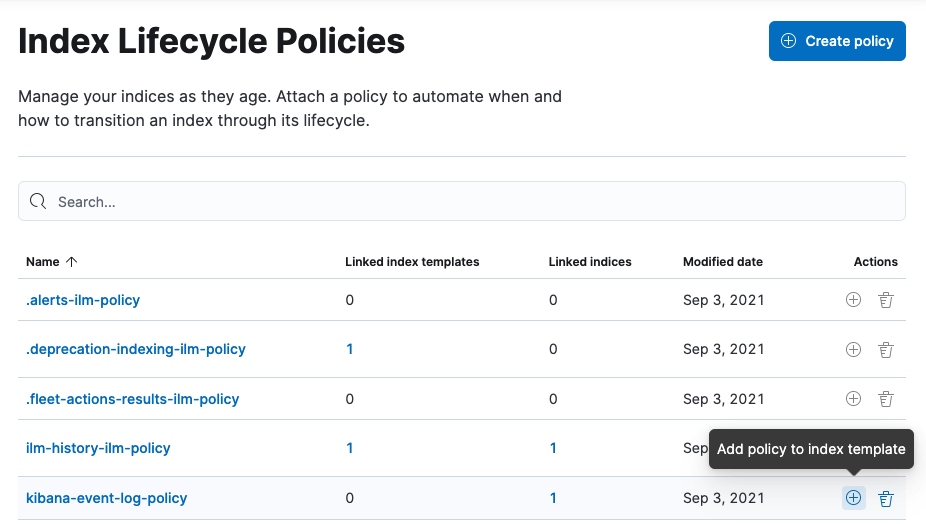

---
mapped_urls:
  - https://www.elastic.co/guide/en/elasticsearch/reference/current/index-lifecycle-management.html
  - https://www.elastic.co/guide/en/elasticsearch/reference/current/overview-index-lifecycle-management.html
  - https://www.elastic.co/guide/en/cloud-enterprise/current/ece-migrate-index-management.html
  - https://www.elastic.co/guide/en/cloud/current/ec-configure-index-management.html
  - https://www.elastic.co/guide/en/cloud/current/ec-migrate-index-management.html
  - https://www.elastic.co/guide/en/elasticsearch/reference/current/ilm-concepts.html
---

% What needs to be done: Refine

% GitHub issue: docs-projects#376

% Scope notes: Combine the linked resources. The "migrate to ILM" one is probably outdated now.

% Use migrated content from existing pages that map to this page:

% - [x] ./raw-migrated-files/elasticsearch/elasticsearch-reference/index-lifecycle-management.md
% - [x] ./raw-migrated-files/elasticsearch/elasticsearch-reference/overview-index-lifecycle-management.md
% - [x] ./raw-migrated-files/docs-content/serverless/elasticsearch-differences.md
% - [ ] ./raw-migrated-files/cloud/cloud/ec-configure-index-management.md
% - [ ] ./raw-migrated-files/cloud/cloud-enterprise/ece-migrate-index-management.md
% - [ ] ./raw-migrated-files/cloud/cloud/ec-migrate-index-management.md

% Internal links rely on the following IDs being on this page (e.g. as a heading ID, paragraph ID, etc):

$$$ilm-gs-alias-bootstrap$$$

$$$manage-time-series-data-without-data-streams$$$

$$$ilm-gs-create-policy$$$

$$$ilm-gs-apply-policy$$$

$$$ilm-gs-create-the-data-stream$$$

$$$ilm-gs-check-progress$$$

$$$ilm-gs-alias-apply-policy$$$

$$$ilm-gs-alias-check-progress$$$

# Index lifecycle management

{{ilm-cap}} ({{ilm-init}}) provides an integrated and streamlined way to manage time-based data such as logs and metrics, making it easier to follow best practices for managing your indices.

You can configure {{ilm-init}} policies to automatically manage indices according to your performance, resiliency, and retention requirements. For example, you could use {{ilm-init}} to:

* Spin up a new index when an index reaches a certain size or number of documents
* Create a new index each day, week, or month and archive previous ones
* Delete stale indices to enforce data retention standards

::::{tip}
{{ilm-init}} is not available on {{es-serverless}}.

:::{dropdown} Why?
In an {{ecloud}} or self-managed environment, ILM lets you automatically transition indices through data tiers according to your performance needs and retention requirements. This allows you to balance hardware costs with performance. {{es-serverless}} eliminates this complexity by optimizing your cluster performance for you.

Data stream lifecycle is an optimized lifecycle tool that lets you focus on the most common lifecycle management needs, without unnecessary hardware-centric concepts like data tiers.
:::
::::

::::{important}
To use {{ilm-init}}, all nodes in a cluster must run the same version. Although it might be possible to create and apply policies in a mixed-version cluster, there is no guarantee they will work as intended. Attempting to use a policy that contains actions that aren’t supported on all nodes in a cluster will cause errors.
::::

## Trigger actions

{{ilm-init}} policies can trigger actions like:

* **Rollover**: Creates a new write index when the current one reaches a certain size, number of docs, or age.
* **Shrink**: Reduces the number of primary shards in an index.
* **Force merge**: Triggers a [force merge](https://www.elastic.co/guide/en/elasticsearch/reference/current/indices-forcemerge.html) to reduce the number of segments in an index’s shards.
* **Delete**: Permanently remove an index, including all of its data and metadata.
* [And more](https://www.elastic.co/guide/en/elasticsearch/reference/current/ilm-actions.html)

Each action has options you can use to specify index behavior and characteristics like:

* The maximum shard size, number of documents, or age at which you want to roll over to a new index.
* The point at which the index is no longer being updated and the number of primary shards can be reduced.
* When to force a merge to permanently remove documents marked for deletion.
* The point at which the index can be moved to less performant hardware.
* The point at which the availability is not as critical and the number of replicas can be reduced.
* When the index can be safely deleted.

For example, if you are indexing metrics data from a fleet of ATMs into Elasticsearch, you might define a policy that says:

1. When the total size of the index’s primary shards reaches 50GB, roll over to a new index.
2. Move the old index into the warm phase, mark it read only, and shrink it down to a single shard.
3. After 7 days, move the index into the cold phase and move it to less expensive hardware.
4. Delete the index once the required 30 day retention period is reached.

**Learn about all available actions in [Index lifecycle actions](https://www.elastic.co/guide/en/elasticsearch/reference/current/ilm-actions.html).**

## Create and manage {{ilm-init}} policies

You can create and manage index lifecycle policies through [{{kib}} Management](/manage-data/lifecycle/index-lifecycle-management/index-management-in-kibana.md) or the [{{ilm-init}} APIs](https://www.elastic.co/docs/api/doc/elasticsearch/v8/group/endpoint-ilm).

Default {{ilm}} policies are created automatically when you use {{agent}}, {{beats}}, or the {{ls}} {{es}} output plugin to send data to the {{stack}}.

::::{tip}
To automatically back up your indices and manage snapshots, use [snapshot lifecycle policies](/deploy-manage/tools/snapshot-and-restore/create-snapshots.md#automate-snapshots-slm).
::::
