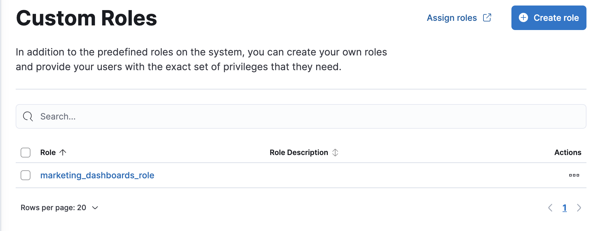

<DocBadge template="technical preview" />
This content applies to: <DocBadge template="elasticsearch" slug="/serverless/elasticsearch/what-is-elasticsearch-serverless" /> <DocBadge template="observability" slug="/serverless/observability/what-is-observability-serverless" /> <DocBadge template="security" slug="/serverless/security/what-is-security-serverless" />

The built-in organization-level roles and instance access roles are great for getting started with ((serverless-full)), and for system administrators who do not need more restrictive access.
With so many features, it's not possible to ship built-in roles that accommodate everyone's needs.
This is where custom roles come in.
{/* Derived from https://www.elastic.co/guide/en/kibana/current/tutorial-secure-access-to-kibana.html#_roles */}

{/*
TBD: Accurate for serverless?
When you assign a user multiple roles, the user receives a union of the roles’ privileges. This means that you cannot reduce the privileges of a user by assigning them an additional role. You must instead remove or edit one of their existing roles.

The `manage_security` cluster privilege is required to access role management.
*/}
You can manage custom roles in **((project-settings)) → ((manage-app)) → Custom Roles**:

{/* TO-DO: This screenshot needs to be refreshed and automated. */}

{/* ## Create a custom role */}

{/* After your roles are set up, the next step to securing access is to assign roles to your users. */}

{/* ## View and delete custom roles */}

