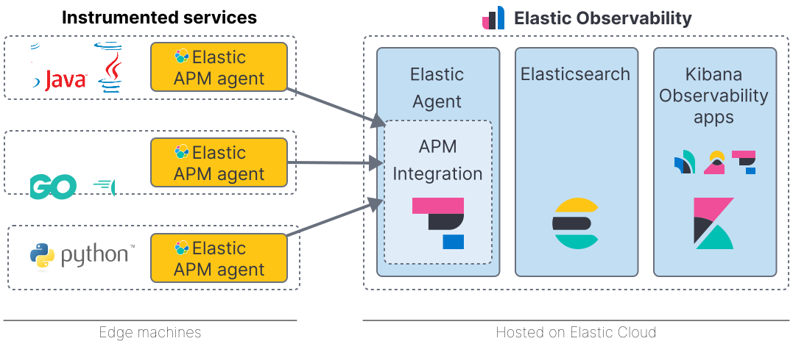
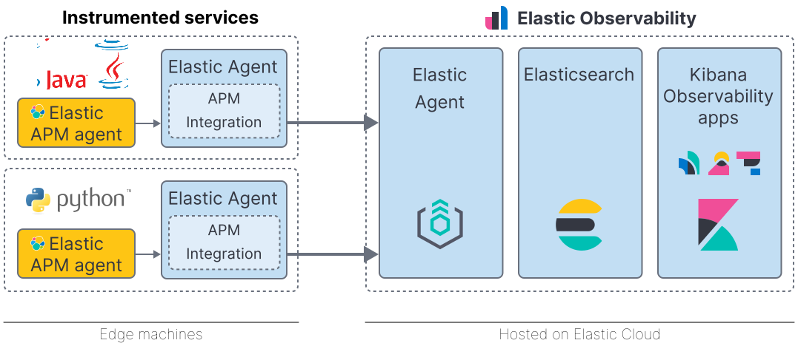

---
mapped_pages:
  - https://www.elastic.co/guide/en/observability/current/apm-upgrade-to-apm-integration.html
applies_to:
  stack:
---

# Switch to the Elastic APM integration [apm-upgrade-to-apm-integration]

The APM integration offers a number of benefits over the standalone method of running APM Server:

**{{fleet}}**:

* A single, unified way to add monitoring for logs, metrics, traces, and other types of data to each host — install one thing instead of multiple
* Central, unified configuration management — no need to edit multiple configuration files

**Data streams**:

* Reduced number of fields per index, better space efficiency, and faster queries
* More granular data control
* Errors and metrics data streams are shared with other data sources — which means better long-term integration with the logs and metrics apps
* Removes template inheritance for {{ilm-init}} policies and makes use of new {{es}} index and component templates
* Fixes _resource 'apm-{{version}}-$type' exists, but it is not an alias_ error

**APM Integration**:

* Easier to install APM on edge machines
* Improved source map handling and {{apm-agent}} configuration management
* Less configuration
* Easier and less error-prone upgrade path
* Zero-downtime configuration changes

## APM integration architecture [apm-arch-upgrade]

Elastic APM consists of four components: **APM agents**, the **Elastic APM integration**, **{{es}}**, and **{{kib}}**. Generally, there are two ways that these four components can work together:

APM agents on edge machines send data to a centrally hosted APM integration:

Or, APM agents and the APM integration live on edge machines and enroll via a centrally hosted {{agent}}:

::::{note}
In order to collect data from RUM and mobile agents, which run in browser and mobile applications, you must run {{agent}} centrally. For other applications, such as backend services, {{agent}} may be co-located on the edge machine.
::::

## Limitations [apm-integration-upgrade-limitations]

There are some limitations to be aware of:

* This change cannot be reverted
* Currently, only the {{es}} output is supported
* APM runs under {{agent}} which, depending on the installation method, might require root privileges
* An {{agent}} with the APM integration enabled must be managed by {{fleet}}.

## Make the switch [_make_the_switch]

Select a guide below to get started.

* [Switch a self-installation](/solutions/observability/apm/switch-self-installation-to-apm-integration.md)
* [Switch an {{ecloud}} cluster](/solutions/observability/apm/switch-an-elastic-cloud-cluster-to-apm-integration.md)
