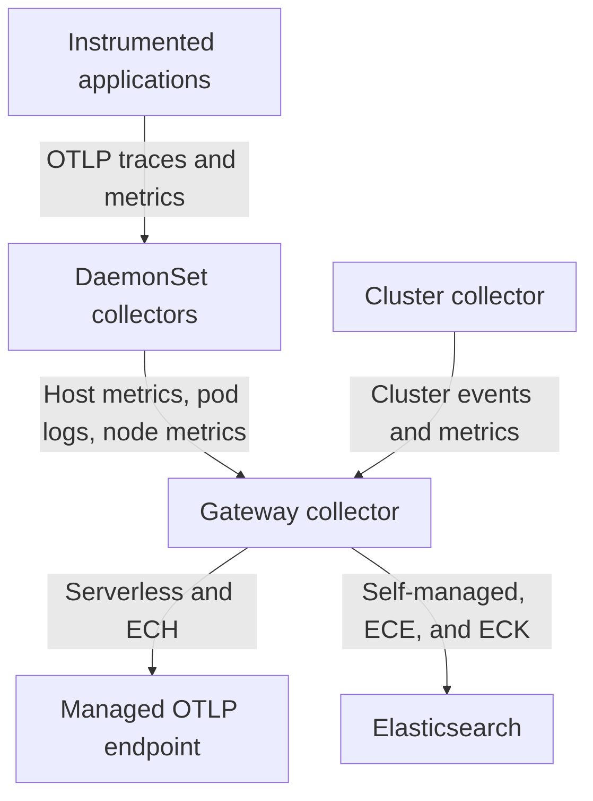

# Deploy EDOT Collector using `OpenTelemetryCollector` custom resources [k8s-edot-cr-deployment]

The [recommended path](/solutions/observability/get-started/opentelemetry/use-cases/kubernetes/deployment.md) for deploying EDOT on {{k8s}} uses the `opentelemetry-kube-stack` Helm chart, which installs the OpenTelemetry Operator and configures all collectors automatically. 

Use the information on this page if you need to create `OpenTelemetryCollector` custom resources (CRs) directly (for example in GitOps workflows, when Helm is unavailable, or when you want fine-grained control over each collector's configuration).

The CRs on this page replicate the architecture that the Helm chart deploys.

## Architecture

All telemetry flows through the gateway collector before reaching Elastic:

- **DaemonSet collectors** run on every node. They collect host metrics, pod logs, and {{k8s}} node metrics, receive OTLP traces and metrics from applications, and forward everything to the gateway.
- **Cluster collector** runs as a single Deployment. It collects cluster-level {{k8s}} events and metrics and forwards them to the gateway.
- **Gateway collector** is the central ingestion layer. It receives OTLP from the DaemonSet and Cluster collectors. For self-managed deployments, the gateway also processes traces for Elastic {{product.apm}} compatibility.

The gateway's export destination depends on your deployment type:

- **{{serverless-short}} and {{ech}}**: gateway exports to the Managed OTLP endpoint.
- **Self-managed, ECE, and {{eck}}**: gateway exports directly to {{es}}.

The following diagram shows how telemetry flows from the collectors to Elastic:



## Prerequisites

- The [OpenTelemetry Operator installed](/solutions/observability/get-started/opentelemetry/use-cases/kubernetes/deployment.md) in the `opentelemetry-operator-system` namespace
- `kubectl` configured to access your cluster
- An {{es}} cluster or a {{serverless-short}}/{{ech}} project

Follow these steps to deploy the EDOT collectors:

::::::{stepper}

:::::{step} Create a credentials secret

All CRs on this page use the dedicated EDOT Collector image. Unlike the full {{agent}} image, this image starts unconditionally in OTel collector mode — you don't need any extra environment variables.

```text subs=true
docker.elastic.co/elastic-agent/elastic-otel-collector:{{version.edot_collector}}
```

Create a {{k8s}} secret with your Elastic credentials in the `opentelemetry-operator-system` namespace.

::::{tab-set}

:::{tab-item} {{serverless-short}} and {{ech}}

```bash
kubectl create secret generic elastic-secret-otel \
  --namespace opentelemetry-operator-system \
  --from-literal=elastic_otlp_endpoint='<YOUR_MANAGED_OTLP_ENDPOINT>' \
  --from-literal=elastic_api_key='<YOUR_API_KEY>'
```

:::

:::{tab-item} Self-managed, ECE, and {{eck}}

```bash
kubectl create secret generic elastic-secret-otel \
  --namespace opentelemetry-operator-system \
  --from-literal=elastic_endpoint='<YOUR_ELASTICSEARCH_ENDPOINT>' \
  --from-literal=elastic_api_key='<YOUR_API_KEY>'
```

:::

::::

:::::

:::::{step} Deploy the gateway collector

The gateway collector is the central ingestion layer. It runs as a Deployment with two replicas for availability.

::::{tab-set}

:::{tab-item} {{serverless-short}} and {{ech}}

```yaml subs=true
apiVersion: opentelemetry.io/v1beta1
kind: OpenTelemetryCollector
metadata:
  name: edot-gateway
  namespace: opentelemetry-operator-system
spec:
  mode: deployment
  image: docker.elastic.co/elastic-agent/elastic-otel-collector:{{version.edot_collector}}
  replicas: 2
  env:
    - name: ELASTIC_OTLP_ENDPOINT
      valueFrom:
        secretKeyRef:
          name: elastic-secret-otel
          key: elastic_otlp_endpoint
    - name: ELASTIC_API_KEY
      valueFrom:
        secretKeyRef:
          name: elastic-secret-otel
          key: elastic_api_key
  config:
    receivers:
      otlp:
        protocols:
          grpc:
            endpoint: 0.0.0.0:4317
          http:
            endpoint: 0.0.0.0:4318
    exporters:
      otlp/ingest_metrics_traces:
        endpoint: ${env:ELASTIC_OTLP_ENDPOINT}
        headers:
          Authorization: ApiKey ${env:ELASTIC_API_KEY}
        sending_queue:
          enabled: true
          sizer: bytes
          queue_size: 50000000
          block_on_overflow: true
          batch:
            flush_timeout: 1s
            min_size: 1000000
            max_size: 4000000
        timeout: 15s
      otlp/ingest_logs:
        endpoint: ${env:ELASTIC_OTLP_ENDPOINT}
        headers:
          Authorization: ApiKey ${env:ELASTIC_API_KEY}
        sending_queue:
          enabled: true
          sizer: bytes
          queue_size: 50000000
          block_on_overflow: true
          batch:
            flush_timeout: 1s
            min_size: 1000000
            max_size: 4000000
        timeout: 15s
    service:
      pipelines:
        traces:
          receivers: [otlp]
          processors: []
          exporters: [otlp/ingest_metrics_traces]
        metrics:
          receivers: [otlp]
          processors: []
          exporters: [otlp/ingest_metrics_traces]
        logs:
          receivers: [otlp]
          processors: []
          exporters: [otlp/ingest_logs]
```

:::

:::{tab-item} Self-managed, ECE, and {{eck}}

```yaml subs=true
apiVersion: opentelemetry.io/v1beta1
kind: OpenTelemetryCollector
metadata:
  name: edot-gateway
  namespace: opentelemetry-operator-system
spec:
  mode: deployment
  image: docker.elastic.co/elastic-agent/elastic-otel-collector:{{version.edot_collector}}
  replicas: 2
  env:
    - name: ELASTIC_ENDPOINT
      valueFrom:
        secretKeyRef:
          name: elastic-secret-otel
          key: elastic_endpoint
    - name: ELASTIC_API_KEY
      valueFrom:
        secretKeyRef:
          name: elastic-secret-otel
          key: elastic_api_key
  config:
    receivers:
      otlp:
        protocols:
          grpc:
            endpoint: 0.0.0.0:4317
          http:
            endpoint: 0.0.0.0:4318
    connectors:
      elasticapm: {}
    processors:
      batch:
        send_batch_size: 1000
        timeout: 1s
        send_batch_max_size: 1500
      batch/metrics:
        send_batch_max_size: 0
        timeout: 1s
      elasticapm: {}
    exporters:
      elasticsearch/otel:
        endpoints:
          - ${env:ELASTIC_ENDPOINT}
        api_key: ${env:ELASTIC_API_KEY}
        mapping:
          mode: otel
    service:
      pipelines:
        traces:
          receivers: [otlp]
          processors: [batch, elasticapm]
          exporters: [elasticapm, elasticsearch/otel]
        metrics:
          receivers: [otlp]
          processors: [batch/metrics]
          exporters: [elasticsearch/otel]
        metrics/aggregated-otel-metrics:
          receivers: [elasticapm]
          processors: []
          exporters: [elasticsearch/otel]
        logs:
          receivers: [otlp]
          processors: [batch]
          exporters: [elasticapm, elasticsearch/otel]
```

:::

::::

The operator creates a Service named `edot-gateway-collector` that exposes ports 4317 (gRPC) and 4318 (HTTP) inside the cluster. DaemonSet and Cluster collectors use this Service name to forward data to the gateway.

:::::

:::::{step} Deploy the DaemonSet collector

The DaemonSet collector runs on every node to collect host metrics, pod logs, {{k8s}} node metrics, and application OTLP telemetry, then forwards everything to the gateway.

Because it requires access to the node's filesystem, Kubelet API, and {{k8s}} object metadata, create a `ServiceAccount` and `ClusterRole` first:

```yaml
apiVersion: v1
kind: ServiceAccount
metadata:
  name: edot-collector
  namespace: opentelemetry-operator-system
---
apiVersion: rbac.authorization.k8s.io/v1
kind: ClusterRole
metadata:
  name: edot-collector
rules:
  - apiGroups: [""]
    resources: [nodes, nodes/proxy, nodes/metrics, services, endpoints, pods, events, namespaces]
    verbs: [get, list, watch]
  - apiGroups: [apps]
    resources: [replicasets, deployments, statefulsets, daemonsets]
    verbs: [get, list, watch]
  - nonResourceURLs: [/metrics, /metrics/cadvisor]
    verbs: [get]
---
apiVersion: rbac.authorization.k8s.io/v1
kind: ClusterRoleBinding
metadata:
  name: edot-collector
subjects:
  - kind: ServiceAccount
    name: edot-collector
    namespace: opentelemetry-operator-system
roleRef:
  kind: ClusterRole
  name: edot-collector
  apiGroup: rbac.authorization.k8s.io
```

Then create the `OpenTelemetryCollector` CR:

```yaml subs=true
apiVersion: opentelemetry.io/v1beta1
kind: OpenTelemetryCollector
metadata:
  name: edot-daemon
  namespace: opentelemetry-operator-system
spec:
  mode: daemonset
  image: docker.elastic.co/elastic-agent/elastic-otel-collector:{{version.edot_collector}}
  serviceAccount: edot-collector
  hostNetwork: true
  securityContext:
    runAsUser: 0
    runAsGroup: 0
  env:
    - name: OTEL_K8S_NODE_NAME
      valueFrom:
        fieldRef:
          fieldPath: spec.nodeName
  volumes:
    - name: varlogpods
      hostPath:
        path: /var/log/pods
    - name: hostfs
      hostPath:
        path: /
  volumeMounts:
    - name: varlogpods
      mountPath: /var/log/pods
      readOnly: true
    - name: hostfs
      mountPath: /hostfs
      readOnly: true
      mountPropagation: HostToContainer
  config:
    receivers:
      otlp:
        protocols:
          grpc:
            endpoint: 0.0.0.0:4317
          http:
            endpoint: 0.0.0.0:4318
      filelog:
        retry_on_failure:
          enabled: true
        start_at: end
        include:
          - /var/log/pods/*/*/*.log
        exclude:
          - /var/log/pods/opentelemetry-operator-system_edot-daemon*/*/*.log
        include_file_name: false
        include_file_path: true
        operators:
          - id: container-parser
            type: container
      hostmetrics:
        collection_interval: 60s
        root_path: /hostfs
        scrapers:
          cpu:
            metrics:
              system.cpu.utilization:
                enabled: true
              system.cpu.logical.count:
                enabled: true
          disk: {}
          load: {}
          filesystem:
            exclude_mount_points:
              mount_points: [/dev/*,/proc/*,/sys/*,/run/k3s/containerd/*,/var/lib/docker/*,/var/lib/kubelet/*,/snap/*]
              match_type: regexp
            exclude_fs_types:
              fs_types: [autofs,binfmt_misc,bpf,cgroup2fs,configfs,debugfs,devpts,devtmpfs,fusectl,hugetlbfs,iso9660,mqueue,nsfs,overlay,proc,procfs,pstore,rpc_pipefs,securityfs,selinuxfs,squashfs,sysfs,tracefs]
              match_type: strict
          memory:
            metrics:
              system.memory.utilization:
                enabled: true
          network: {}
          paging:
            metrics:
              system.paging.utilization:
                enabled: true
          process:
            mute_process_exe_error: true
            mute_process_io_error: true
            mute_process_user_error: true
      kubeletstats:
        auth_type: serviceAccount
        collection_interval: 60s
        endpoint: ${env:OTEL_K8S_NODE_NAME}:10250
        node: ${env:OTEL_K8S_NODE_NAME}
        insecure_skip_verify: true
    processors:
      batch: {}
      batch/metrics:
        send_batch_max_size: 0
        timeout: 1s
      k8sattributes:
        filter:
          node_from_env_var: OTEL_K8S_NODE_NAME
        passthrough: false
        pod_association:
          - sources:
              - from: resource_attribute
                name: k8s.pod.ip
          - sources:
              - from: resource_attribute
                name: k8s.pod.uid
          - sources:
              - from: connection
        extract:
          metadata:
            - k8s.namespace.name
            - k8s.deployment.name
            - k8s.replicaset.name
            - k8s.statefulset.name
            - k8s.daemonset.name
            - k8s.cronjob.name
            - k8s.job.name
            - k8s.node.name
            - k8s.pod.name
            - k8s.pod.ip
            - k8s.pod.uid
            - k8s.pod.start_time
      resourcedetection/system:
        detectors: [system]
        system:
          hostname_sources: [os]
      resource/hostname:
        attributes:
          - key: host.name
            from_attribute: k8s.node.name
            action: upsert
    exporters:
      otlp/gateway:
        endpoint: "http://edot-gateway-collector.opentelemetry-operator-system.svc.cluster.local:4317"
        tls:
          insecure: true
    service:
      pipelines:
        logs: null
        metrics: null
        traces: null
        logs/node:
          receivers: [filelog]
          processors: [batch, k8sattributes, resourcedetection/system, resource/hostname]
          exporters: [otlp/gateway]
        metrics/node:
          receivers: [kubeletstats, hostmetrics]
          processors: [batch/metrics, k8sattributes, resourcedetection/system, resource/hostname]
          exporters: [otlp/gateway]
        metrics/app:
          receivers: [otlp]
          processors: [batch/metrics, resource/hostname]
          exporters: [otlp/gateway]
        logs/app:
          receivers: [otlp]
          processors: [batch, resource/hostname]
          exporters: [otlp/gateway]
        traces/app:
          receivers: [otlp]
          processors: [batch, resource/hostname]
          exporters: [otlp/gateway]
```

::::{note}
The example above includes `resourcedetection/system` for host attribute detection. For cloud-managed {{k8s}} clusters, also add the appropriate cloud provider detector: `resourcedetection/eks` for {{aws}} EKS, `resourcedetection/gcp` for Google GKE, or `resourcedetection/aks` for Azure AKS. Refer to the [kube-stack `values.yaml`](https://github.com/elastic/elastic-agent/blob/main/deploy/helm/edot-collector/kube-stack/values.yaml) for the complete processor configurations.
::::

:::::

:::::{step} Deploy the cluster collector

The cluster collector runs as a single Deployment to gather cluster-level {{k8s}} events and metrics. It reuses the same `edot-collector` ServiceAccount created in the previous step.

```yaml subs=true
apiVersion: opentelemetry.io/v1beta1
kind: OpenTelemetryCollector
metadata:
  name: edot-cluster
  namespace: opentelemetry-operator-system
spec:
  mode: deployment
  replicas: 1
  image: docker.elastic.co/elastic-agent/elastic-otel-collector:{{version.edot_collector}}
  serviceAccount: edot-collector
  env:
    - name: OTEL_K8S_NODE_NAME
      valueFrom:
        fieldRef:
          fieldPath: spec.nodeName
  config:
    receivers:
      k8s_events: {}
      k8s_cluster:
        collection_interval: 60s
        node_conditions_to_report: [Ready, MemoryPressure]
        allocatable_types_to_report: [cpu, memory]
    processors:
      batch: {}
      k8sattributes:
        passthrough: false
        pod_association:
          - sources:
              - from: resource_attribute
                name: k8s.pod.ip
          - sources:
              - from: resource_attribute
                name: k8s.pod.uid
          - sources:
              - from: connection
        extract:
          metadata:
            - k8s.namespace.name
            - k8s.node.name
            - k8s.pod.name
            - k8s.pod.uid
      resource/hostname:
        attributes:
          - key: host.name
            from_attribute: k8s.node.name
            action: upsert
    exporters:
      otlp/gateway:
        endpoint: "http://edot-gateway-collector.opentelemetry-operator-system.svc.cluster.local:4317"
        tls:
          insecure: true
    service:
      pipelines:
        logs:
          receivers: [k8s_events]
          processors: [batch, resource/hostname]
          exporters: [otlp/gateway]
        metrics:
          receivers: [k8s_cluster]
          processors: [batch, k8sattributes, resource/hostname]
          exporters: [otlp/gateway]
```

:::::

:::::{step} Confirm the collectors are running

Confirm the collector resources and their pods are running:

```bash
kubectl get opentelemetrycollectors -n opentelemetry-operator-system
kubectl get pods -n opentelemetry-operator-system
```

Confirm you see:

- Two `edot-gateway` Deployment pods
- One `edot-daemon` DaemonSet pod per node
- One `edot-cluster` Deployment pod

:::::

:::::{step} Confirm you see the data in {{kib}}

1. Open the **[OTEL][Metrics Kubernetes] Cluster Overview** dashboard in {{kib}}.

2. In **Discover**, confirm data is available in the `logs-*` and `metrics-*` {{data-sources}}.

:::{note}
This step verifies only logs and metrics because the collectors generate them automatically from {{k8s}} infrastructure. Traces appear in the `traces-*` {{data-sources}} only after you [instrument your applications](/solutions/observability/get-started/opentelemetry/use-cases/kubernetes/instrumenting-applications.md) to send OTLP data to the collectors.
:::

If no data appears, refer to [No logs, metrics, or traces visible in {{kib}}](/troubleshoot/ingest/opentelemetry/no-data-in-kibana.md).

:::::

::::::
