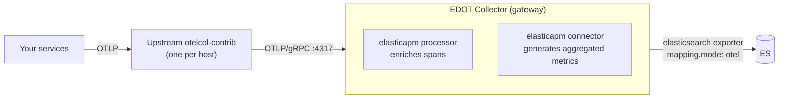

# Send data from an upstream OpenTelemetry Collector [upstream-collector-self-managed]

This guide shows how to forward telemetry data from an existing (upstream) OpenTelemetry Collector to a self-managed {{stack}} using an EDOT Collector configured as a gateway. The examples use the [contrib distribution](https://github.com/open-telemetry/opentelemetry-collector-releases/tree/main/distributions/otelcol-contrib) (`otelcol-contrib`), but the same approach works with any OTel Collector distribution, including vendor distributions and custom builds assembled with the [OpenTelemetry Collector Builder](https://opentelemetry.io/docs/collector/custom-collector/).

## When to use this setup

Use this pattern if you:

* Already run an existing OpenTelemetry Collector and want to add Elastic as a backend without replacing your current setup
* Need to fan out telemetry to multiple observability backends from a single Collector
* Evaluate Elastic alongside another backend before committing to a full migration
* Use a technology or language for which Elastic doesn't provide an EDOT distribution

## Architecture

Your services send telemetry to the contrib Collector (`otelcol-contrib`), which forwards it over OTLP/gRPC to the EDOT Collector gateway. The gateway applies Elastic-specific processing and writes directly to {{es}}.



The `elasticsearch` exporter with `mapping.mode: otel` is the recommended path for self-managed deployments. The Managed OTLP endpoint isn't available for self-managed installations. Sending directly to {{apm-server-or-mis}} through OTLP is also possible but not recommended. Use the EDOT gateway path when available.

## Prerequisites

* A running self-managed {{es}} cluster
* The [EDOT Collector](elastic-agent://reference/edot-collector/index.md) installed on the gateway host. It ships as part of the {{agent}} package and runs as {{agent}} in `otel` mode.
* An existing OpenTelemetry Collector installed on your agent hosts. This guide uses [`otelcol-contrib`](https://opentelemetry.io/docs/collector/installation/).
* Network connectivity from your Collector hosts to the EDOT gateway host on port 4317

::::{stepper}

:::{step} Create an {{es}} API key

The EDOT gateway authenticates to {{es}} using an API key.

1. In {{kib}}, navigate to **{{stack-manage-app}}** → **API keys**.
2. Select **Create API key**.
3. Give the key a name (for example, `edot-gateway`) and assign it the necessary privileges for writing to {{es}} data streams.
4. Copy the encoded key to use as the `ELASTIC_API_KEY` value in the gateway configuration.

:::

:::{step} Configure the EDOT gateway

Create a configuration file for the EDOT Collector acting as a gateway. Save this as `gateway.yml` on the gateway host.

Set the following environment variables on the gateway host before starting the Collector:

```bash
export ELASTIC_ENDPOINT=https://your-elasticsearch:9200
export ELASTIC_API_KEY=your-encoded-api-key
```

Then create `gateway.yml`:

```yaml
receivers:
  otlp:
    protocols:
      grpc:
        endpoint: 0.0.0.0:4317
      http:
        endpoint: 0.0.0.0:4318

connectors:
  elasticapm: {}

processors:
  elasticapm: {}

exporters:
  elasticsearch/otel:
    endpoints:
      - ${env:ELASTIC_ENDPOINT}
    api_key: ${env:ELASTIC_API_KEY}
    mapping:
      mode: otel
    batcher:
      enabled: true
      min_size_items: 1000
      max_size_items: 1500
      flush_timeout: 1s

service:
  pipelines:
    traces:
      receivers: [otlp]
      processors: [elasticapm]
      exporters: [elasticapm, elasticsearch/otel]
    metrics:
      receivers: [otlp]
      processors: []
      exporters: [elasticsearch/otel]
    metrics/aggregated-otel-metrics:
      receivers: [elasticapm]
      processors: []
      exporters: [elasticsearch/otel]
    logs:
      receivers: [otlp]
      processors: []
      exporters: [elasticsearch/otel]
```

Key components in this configuration:

* **`elasticapm` processor** (under `processors`): Enriches spans with attributes required by the {{product.apm}} UI.
* **`elasticapm` connector** (under `connectors`): Generates pre-aggregated {{product.apm}} metrics from trace data. It appears as an exporter in the `traces` pipeline and as a receiver in the `metrics/aggregated-otel-metrics` pipeline.
* **`elasticsearch/otel` exporter**: Writes data directly to {{es}} using native OpenTelemetry data streams (`mapping.mode: otel`). Batching is handled by the {{es}} exporter's built-in `batcher` instead of the `batch` processor, which avoids data loss when the downstream export is rejected.

:::{note}
The `elasticapm` connector and processor are required for full {{product.apm}} functionality (service maps, transaction histograms, service-level indicators). You only need them when exporting directly to {{es}}. If you send to the Managed OTLP endpoint or {{apm-server-or-mis}}, they are not required.

Refer to [{{product.apm}} services missing due to misconfigured elasticapm connector](/troubleshoot/ingest/opentelemetry/edot-collector/misconfigured-elasticapm-connector.md) for more information.
:::

Start the EDOT gateway. The EDOT Collector is the {{agent}} binary run in `otel` mode, so start it with the `otel` subcommand:

```bash
elastic-agent otel --config gateway.yml
```

:::

:::{step} Configure the contrib Collector

On each contrib Collector host, configure the OTLP exporter to point to the EDOT gateway. Add or update the `exporters` and `service` sections in your existing `config.yml`:

```yaml
exporters:
  otlp:
    endpoint: "gateway-host:4317"
    tls:
      insecure: true  # Set to `false` and configure `ca_file` for production

service:
  pipelines:
    traces:
      exporters: [otlp]
    metrics:
      exporters: [otlp]
    logs:
      exporters: [otlp]
```

Replace `gateway-host` with the hostname or IP of your EDOT gateway host. In production, configure TLS to secure communication between the contrib Collector and the gateway.

:::{tip}
Set the `deployment.environment` resource attribute in your contrib Collector so that services appear under the correct environment in the {{kib}} {{product.apm}} Service Map. Without it, all services show as "unset" in the environment selector.

```yaml
processors:
  resource:
    attributes:
      - key: deployment.environment
        action: insert
        value: production
```

Refer to [Attributes and labels](/solutions/observability/apm/opentelemetry/attributes.md) for more details.
:::

Restart the contrib Collector to apply the changes.

:::

:::{step} Verify data in {{kib}}

After starting both Collectors, wait a few minutes for data to appear. Then verify in {{kib}}:

* Navigate to **{{observability}}** → **{{product.apm}}** → **Services** to confirm your services appear.
* Navigate to **{{observability}}** → **{{product.apm}}** → **Service Map** to confirm environment-based filtering works.
* Navigate to **Discover** and check the `traces-generic.otel-default`, `logs-generic.otel-default`, and `metrics-generic.otel-default` data streams for incoming data.

If no data appears, refer to [No logs, metrics, or traces visible in {{kib}}](/troubleshoot/ingest/opentelemetry/no-data-in-kibana.md).

:::

::::
