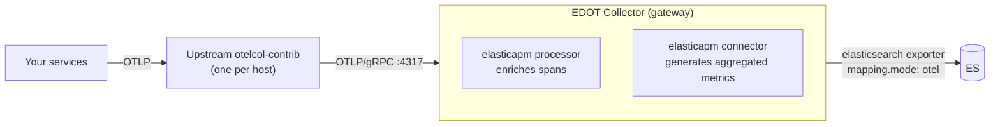

# Send data from an contrib OpenTelemetry Collector [upstream-collector-self-managed]

This guide shows how to forward telemetry data from an upstream contrib OpenTelemetry Collector to a self-managed {{stack}} using an EDOT Collector in gateway mode.

## When to use this setup

Use this pattern if you:

* Already run a contrib OpenTelemetry Collector and want to add Elastic as a backend without replacing your existing setup
* Need to fan out telemetry to multiple observability backends from a single contrib Collector
* Evaluate Elastic alongside another backend before committing to a full migration
* Use a technology or language that Elastic doesn't provide an EDOT distribution for

## Architecture

Your services send telemetry to the contrib otelcol-contrib, which forwards it over OTLP/gRPC to the EDOT Collector gateway. The gateway applies Elastic-specific processing and writes directly to {{es}}.



The `elasticsearch` exporter with `mapping.mode: otel` is the recommended path for self-managed deployments. The Managed OTLP endpoint is not available for self-managed installations.

## Prerequisites

* A running self-managed {{es}} cluster
* The [EDOT Collector binary](elastic-agent://reference/edot-collector/index.md) installed on the gateway host
* The [contrib OpenTelemetry Collector](https://opentelemetry.io/docs/collector/installation/) installed on your agent hosts
* Network connectivity from the contrib Collector hosts to the EDOT gateway host on port 4317

::::{stepper}

:::{step} Create an {{es}} API key

The EDOT gateway authenticates to {{es}} using an API key.

1. In {{kib}}, navigate to **{{stack-manage-app}}** → **API keys**.
2. Select **Create API key**.
3. Give the key a name (for example, `edot-gateway`) and assign it the necessary privileges for writing to {{es}} data streams.
4. Copy the encoded key. You will use it as `ELASTIC_API_KEY` in the gateway configuration.

:::

:::{step} Configure the EDOT gateway

Create a configuration file for the EDOT Collector running in gateway mode. Save this as `gateway.yml` on the gateway host.

Set the following environment variables on the gateway host before starting the Collector:

```bash
export ELASTIC_ENDPOINT=https://your-elasticsearch:9200
export ELASTIC_API_KEY=your-encoded-api-key
```

Then create `gateway.yml`:

```yaml
receivers:
  otlp:
    protocols:
      grpc:
        endpoint: 0.0.0.0:4317
      http:
        endpoint: 0.0.0.0:4318

connectors:
  elasticapm: {}

processors:
  batch:
    send_batch_size: 1000
    timeout: 1s
    send_batch_max_size: 1500
  batch/metrics:
    send_batch_max_size: 0
    timeout: 1s
  elasticapm: {}

exporters:
  elasticsearch/otel:
    endpoints:
      - ${env:ELASTIC_ENDPOINT}
    api_key: ${env:ELASTIC_API_KEY}
    mapping:
      mode: otel

service:
  pipelines:
    traces:
      receivers: [otlp]
      processors: [batch, elasticapm]
      exporters: [elasticapm, elasticsearch/otel]
    metrics:
      receivers: [otlp]
      processors: [batch/metrics]
      exporters: [elasticsearch/otel]
    metrics/aggregated-otel-metrics:
      receivers: [elasticapm]
      processors: []
      exporters: [elasticsearch/otel]
    logs:
      receivers: [otlp]
      processors: [batch]
      exporters: [elasticsearch/otel]
```

Key components in this configuration:

* **`elasticapm` processor** (under `processors`): Enriches spans with attributes required by the {{product.apm}} UI.
* **`elasticapm` connector** (under `connectors`): Generates pre-aggregated {{product.apm}} metrics from trace data. It appears as an exporter in the `traces` pipeline and as a receiver in the `metrics/aggregated-otel-metrics` pipeline.
* **`elasticsearch/otel` exporter**: Writes data directly to {{es}} using native OpenTelemetry data streams (`mapping.mode: otel`).

:::{note}
The `elasticapm` connector and processor are required for full {{product.apm}} functionality (service maps, transaction histograms, service-level indicators). You only need them when exporting directly to {{es}}. If you send to the Managed OTLP endpoint or {{apm-server-or-mis}}, they are not required.

Refer to [{{product.apm}} services missing due to misconfigured elasticapm connector](/troubleshoot/ingest/opentelemetry/edot-collector/misconfigured-elasticapm-connector.md) for more information.
:::

Start the EDOT gateway:

```bash
edot-collector --config gateway.yml
```

:::

:::{step} Configure the contrib otelcol-contrib

On each contrib Collector host, configure the OTLP exporter to point to the EDOT gateway. Add or update the `exporters` and `service` sections in your existing `config.yml`:

```yaml
exporters:
  otlp:
    endpoint: "gateway-host:4317"
    tls:
      insecure: true  # Set to false and configure ca_file for production

service:
  pipelines:
    traces:
      exporters: [otlp]
    metrics:
      exporters: [otlp]
    logs:
      exporters: [otlp]
```

Replace `gateway-host` with the hostname or IP of your EDOT gateway host. In production, configure TLS to secure communication between the contrib Collector and the gateway.

:::{tip}
Set the `deployment.environment` resource attribute in your contrib Collector so that services appear under the correct environment in the {{kib}} {{product.apm}} Service Map. Without it, all services show as "unset" in the environment selector.

```yaml
processors:
  resource:
    attributes:
      - key: deployment.environment
        action: insert
        value: production
```

Refer to [Attributes and labels](/solutions/observability/apm/opentelemetry/attributes.md) for more details.
:::

Restart the contrib Collector to apply the changes.

:::

:::{step} Verify data in {{kib}}

After starting both Collectors, wait a few minutes for data to appear. Then verify in {{kib}}:

1. Navigate to **Observability** → **{{product.apm}}** → **Services** to confirm your services appear.
2. Navigate to **Observability** → **{{product.apm}}** → **Service Map** to confirm environment-based filtering works.
3. Navigate to **Discover** and check the `traces-generic.otel-default`, `logs-generic.otel-default`, and `metrics-generic.otel-default` data streams for incoming data.

If no data appears, refer to [No logs, metrics, or traces visible in {{kib}}](/troubleshoot/ingest/opentelemetry/no-data-in-kibana.md).

:::

::::

## Deploy on {{k8s}} [upstream-collector-k8s]

If you're running in {{k8s}}, you can deploy the EDOT gateway as a {{k8s}} `Deployment` and expose it as a `Service` so contrib Collectors can reach it using the cluster DNS.

The EDOT Collector image for standalone use is `docker.elastic.co/elastic-agent/elastic-otel-collector`.

### Create a secret for credentials

```bash
kubectl create secret generic elastic-secret-otel \
  --from-literal=elastic_endpoint='https://your-elasticsearch:9200' \
  --from-literal=elastic_api_key='your-encoded-api-key'
```

### Deploy the EDOT gateway

Apply the following manifest. The `ConfigMap` holds the gateway configuration, the `Deployment` runs the EDOT Collector, and the `Service` exposes port 4317 for contrib Collectors inside the cluster.

```yaml
apiVersion: v1
kind: ConfigMap
metadata:
  name: edot-gateway-config
data:
  gateway.yaml: |
    receivers:
      otlp:
        protocols:
          grpc:
            endpoint: 0.0.0.0:4317
          http:
            endpoint: 0.0.0.0:4318
    connectors:
      elasticapm: {}
    processors:
      batch:
        send_batch_size: 1000
        timeout: 1s
        send_batch_max_size: 1500
      batch/metrics:
        send_batch_max_size: 0
        timeout: 1s
      elasticapm: {}
    exporters:
      elasticsearch/otel:
        endpoints:
          - ${env:ELASTIC_ENDPOINT}
        api_key: ${env:ELASTIC_API_KEY}
        mapping:
          mode: otel
    service:
      pipelines:
        traces:
          receivers: [otlp]
          processors: [batch, elasticapm]
          exporters: [elasticapm, elasticsearch/otel]
        metrics:
          receivers: [otlp]
          processors: [batch/metrics]
          exporters: [elasticsearch/otel]
        metrics/aggregated-otel-metrics:
          receivers: [elasticapm]
          processors: []
          exporters: [elasticsearch/otel]
        logs:
          receivers: [otlp]
          processors: [batch]
          exporters: [elasticsearch/otel]
---
apiVersion: apps/v1
kind: Deployment
metadata:
  name: edot-gateway
  labels:
    app: edot-gateway
spec:
  replicas: 2
  selector:
    matchLabels:
      app: edot-gateway
  template:
    metadata:
      labels:
        app: edot-gateway
    spec:
      containers:
        - name: edot-gateway
          image: docker.elastic.co/elastic-agent/elastic-otel-collector:{{version.edot_collector}}
          args: ["--config", "/etc/edot/gateway.yaml"]
          env:
            - name: ELASTIC_AGENT_OTEL
              value: "true"
            - name: ELASTIC_ENDPOINT
              valueFrom:
                secretKeyRef:
                  name: elastic-secret-otel
                  key: elastic_endpoint
            - name: ELASTIC_API_KEY
              valueFrom:
                secretKeyRef:
                  name: elastic-secret-otel
                  key: elastic_api_key
          ports:
            - containerPort: 4317  # gRPC
            - containerPort: 4318  # HTTP
          volumeMounts:
            - name: config
              mountPath: /etc/edot
      volumes:
        - name: config
          configMap:
            name: edot-gateway-config
---
apiVersion: v1
kind: Service
metadata:
  name: edot-gateway
spec:
  selector:
    app: edot-gateway
  ports:
    - name: otlp-grpc
      port: 4317
      targetPort: 4317
    - name: otlp-http
      port: 4318
      targetPort: 4318
```

### Configure the contrib Collector

Point the contrib otelcol-contrib OTLP exporter at the gateway `Service`:

```yaml
exporters:
  otlp:
    endpoint: "edot-gateway:4317"
    tls:
      insecure: true  # Set to false and configure ca_file for production
```

:::{note}
For comprehensive {{k8s}} observability (including host metrics, pod logs, {{k8s}} events, and cluster metrics) use the `opentelemetry-kube-stack` Helm chart with the Elastic values instead. Refer to [{{k8s}} observability](/solutions/observability/get-started/opentelemetry/use-cases/kubernetes/index.md).
:::

## Next steps

* [EDOT Collector gateway configuration reference](elastic-agent://reference/edot-collector/config/default-config-standalone.md#gateway-mode)
* [{{k8s}} observability with EDOT](/solutions/observability/get-started/opentelemetry/use-cases/kubernetes/index.md)
* [Attributes and labels](/solutions/observability/apm/opentelemetry/attributes.md)
* [EDOT compared to contrib OpenTelemetry](opentelemetry://reference/compatibility/edot-vs-upstream.md)
