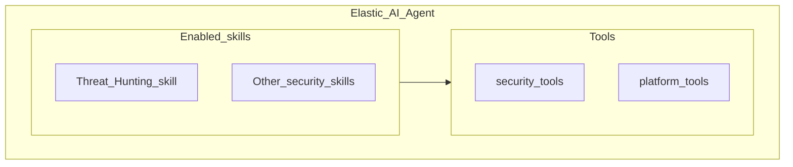

# Elastic AI Agent, skills, and tools in {{elastic-sec}} [elastic-ai-agent-skills-model]

Starting in version 9.4, {{elastic-sec}} centers on a single default [Elastic AI Agent](/explore-analyze/ai-features/agent-builder/builtin-agents-reference.md#elastic-ai-agent) that you extend with modular *skills*. Each skill packages domain-specific instructions, a curated set of [tools](/explore-analyze/ai-features/agent-builder/tools.md), and context for a SOC workflow so you don't switch between separate agents for hunting, triage, or response.

For product-wide mechanics (creating custom skills, APIs, and the full built-in skills catalog), see the Skills in {{agent-builder}}, built-in skills reference, and Skill creation guidelines pages when those docs publish (in progress).

% After docs-content#5868 merges, restore links:
% [Skills in {{agent-builder}}](/explore-analyze/ai-features/agent-builder/skills.md)
% [Built-in skills reference](/explore-analyze/ai-features/agent-builder/builtin-skills-reference.md)

## How the pieces fit together

| Layer | What it is | In {{elastic-sec}} |
|-------|------------|-------------------|
| Agent | The conversational AI you chat with—reasoning, instructions, and tool use in one loop | The [Elastic AI Agent](/explore-analyze/ai-features/agent-builder/builtin-agents-reference.md#elastic-ai-agent) is the default agent in Agent Builder for security workflows. |
| Skill | A modular capability pack: specialized instructions plus the tools and context for one domain | Security skills (for example, threat hunting or alert triage) that you can enable or disable for your team. |
| Tool | A discrete action the agent can run (query data, open a case, run a workflow) | Shared [built-in tools](/explore-analyze/ai-features/agent-builder/tools/builtin-tools-reference.md); the same tool can appear in more than one skill. |

You talk to the agent in natural language. The agent picks tools based on your request, the skills you turned on, and its instructions. You don't invoke tools directly.

## Enable and manage skills

Use the skill controls in Agent Builder to turn skills on or off for your workspace.

:::{note}
Confirm UI labels and the exact screen with @dhru42 before publishing screenshots of the skill selector.
:::

For details on assigning skills to agents and using the Skills APIs, see the Skills in {{agent-builder}} page when it publishes (in progress).

% [Skills in {{agent-builder}}](/explore-analyze/ai-features/agent-builder/skills.md)

## Relationship to the standalone Threat Hunting Agent

In {{stack}} 9.3 and earlier Agent Builder documentation, {{elastic-sec}} documented a separate Threat Hunting Agent built-in agent. That standalone agent is deprecated starting in 9.4. Threat hunting workflows now use the Elastic AI Agent with the Threat Hunting skill enabled. For migration guidance, refer to the [Threat Hunting Agent](/explore-analyze/ai-features/agent-builder/builtin-agents-reference.md#threat-hunting-agent) section in the built-in agents reference.

## Frequently asked questions

### How is this different from Elastic AI Assistant?

[Elastic AI Assistant](/solutions/security/ai/ai-assistant.md) is the legacy in-product assistant embedded across {{elastic-sec}} workflows. Agent Builder is the platform for configurable agents, tools, and skills. Skills and tools in Agent Builder replace the older split between broad “capabilities” and one-off workflows. For how skills relate to tools and prompts, see the Skills in {{agent-builder}} page when it publishes (in progress).

% [Skills in {{agent-builder}}](/explore-analyze/ai-features/agent-builder/skills.md)

### Can I use more than one skill in a conversation?

You can enable multiple skills for the agent. The agent decides which skill context and tools apply based on your request. If product limits apply (for example, which skills can be active together), confirm the current behavior with @dhru42 or in release notes.

### Can I create custom Security skills?

Custom skills and enterprise options are evolving. See the Skills in {{agent-builder}} and Skill creation guidelines pages when they publish (in progress) for what is supported in your deployment tier. Confirm tier and roadmap details with @dhru42 or your Elastic contact.

% [Skills in {{agent-builder}}](/explore-analyze/ai-features/agent-builder/skills.md)
% [Skill creation guidelines](/explore-analyze/ai-features/agent-builder/skill-creation-guidelines.md)

## Related pages

- [Agent Builder for {{elastic-sec}}](agent-builder.md)
- [Security skills use cases](skills-use-cases.md)
- [Built-in agents reference](/explore-analyze/ai-features/agent-builder/builtin-agents-reference.md)
- [Tools in {{agent-builder}}](/explore-analyze/ai-features/agent-builder/tools.md)
