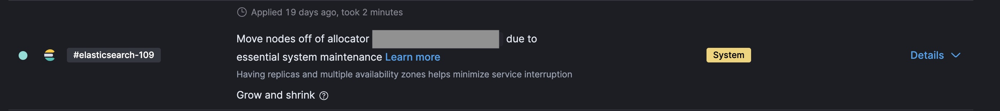

# Understanding node moves and system maintenance [ec-deployment-node-move]

To ensure that your deployment nodes are located on healthy hosts, we vacate nodes to perform essential system maintenance or to remove a host with hardware issues from service. These tasks cannot be skipped or delayed.

All major scheduled maintenance and incidents can be found on the Elastic [status page](https://status.elastic.co/). You can subscribe to that page to be notified about updates.

If events on your deployment don’t correlate to any items listed on the status page, the events are due to minor essential maintenance performed on only a subset of {{ech}} deployments.

This document explains the "`Move nodes off of allocator...`" message that appears on the [activity page](../../deploy-manage/deploy/elastic-cloud/keep-track-of-deployment-activity.md) in {{ech}} deployments, helping you understand its meaning, implications, and what to expect.

::::{note}
You can [configure email notifications](#email) to be alerted when this situation occurs.
::::

## Possible causes and impact [ec-node-host-outages]

Potential causes of system maintenance include, but not limited to, situations like:

* A host where the Cloud Service Provider (CSP), like AWS, GCP, or Azure, has reported upcoming hardware deprecation or identified issues requiring remediation.
* Abrupt host termination by the CSP due to underlying infrastructure problems.
* Mandatory host operating system (OS) patching or upgrades for security or compliance reasons.
* Other scheduled maintenance announced on the [Elastic status page](https://status.elastic.co/).

Depending on the cause of the node movement, the behavior and expectations differ.

* During planned operations, such as hardware upgrades or host patches, the system attempts to gracefully move the node to another host before shutting down the original one. This process allows shard relocation to complete ahead of time, minimizing any potential disruption.

* In contrast, if a node’s host experiences an unexpected outage, the system automatically vacates the node and displays a related `Don't attempt to gracefully move shards` message on the [activity page](../../deploy-manage/deploy/elastic-cloud/keep-track-of-deployment-activity.md), skipping the check to ensure the node’s shards have been moved before shutdown.

## Behavior during system maintenance [ec-node-behavior-maintenance]

The following sections describe how your deployment behaves during maintenance, how to reduce risks such as data loss, and how to stay informed. If you still have questions or concerns about system maintenance activities after reviewing this content, please reach out to [Elastic support](/troubleshoot/index.md#contact-us) for help.

### Service availability during node vacate

Unless overridden or unable, the system will automatically recover the vacated node’s data automatically from replicas or snapshots. If your cluster has [high availability (HA)](/deploy-manage/deploy/elastic-cloud/elastic-cloud-hosted-planning.md#ec-ha) configured, all search and indexing requests should continue to work within the reduced capacity as the node is replaced.

Overall, having replicas and multiple availability zones helps minimize service interruption.

### Data loss risk for non-HA deployments

The system maintenance process always attempts to recover the vacated node's data from replicas or snapshots. However, if the deployment is not configured with HA, including replica shards, the maintenance process may not be able to recover the data from the vacated node.

To minimize this risk, ensure your deployment follows the [high availability best practices](/deploy-manage/deploy/elastic-cloud/elastic-cloud-hosted-planning.md#ec-ha), which recommend:
- Using at least two availability zones for production systems (three for mission-critical systems).
- Configuring one or more replicas for each index (except for searchable snapshot indexes).

As long as these recommendations are followed, system maintenance processes should not impact the availability of the data in the deployment.

### Data loss risk without replica shards

Configuring multiple availability zones helps your deployment remain available for indexing and search requests if one zone becomes unavailable. However, this alone does not guarantee data availability. To ensure that your data remains accessible, indices must be configured with [replica shards](/deploy-manage/distributed-architecture/clusters-nodes-shards.md).

If an index has no replica shards and its primary shard is located on a node that must be vacated, data loss may occur if the system is unable to move the node gracefully during the maintenance activity.

### Performance considerations during system maintenance

The performance impact of system maintenance depends on how well the deployment is sized. Well-provisioned clusters with sufficient buffer capacity typically remain unaffected, while deployments already operating near their limits may experience slowdowns, or even intermittent request failures, during node vacating.

High availability assumes not just redundancy in data and zones, but also the ability to absorb the loss or restart of a node without service disruption. As mentioned in :

::::{admonition} Availability zones and performance
Increasing the number of zones should not be used to add more resources. The concept of zones is meant for High Availability (2 zones) and Fault Tolerance (3 zones), but neither will work if the cluster relies on the resources from those zones to be operational.

The recommendation is to **scale up the resources within a single zone until the cluster can take the full load (add some buffer to be prepared for a peak of requests)**, then scale out by adding additional zones depending on your requirements: 2 zones for High Availability, 3 zones for Fault Tolerance.
::::

At a minimum, you should size your deployment to tolerate the temporary loss of one node in order to avoid single points of failure and ensure proper HA. For critical systems, ensure that the deployment can continue operating even in the event of losing an entire availability zone.

### Set up email alerts for node changes [email]

To receive an email when nodes are added or removed from your deployment:

1. Enable [Stack monitoring](/deploy-manage/monitor/stack-monitoring/ece-ech-stack-monitoring.md#enable-logging-and-monitoring-steps) (logs and metrics) on your deployment. Only metrics collection is required for these notifications to work.

In the deployment used as the destination of Stack monitoring:

2. Create [Stack monitoring default rules](/deploy-manage/monitor/monitoring-data/configure-stack-monitoring-alerts.md#_create_default_rules).

3. (Optional) Configure an email [connector](/deploy-manage/manage-connectors.md). If you prefer, use the pre-configured `Elastic-CLoud-SMTP`.

4. Edit the rule  **Cluster alerting** → **{{es}} nodes changed** and select the email connector.

::::{note}
If you have only one master node in your cluster, during the master node vacate no notification will be sent. Kibana needs to communicate with the master node in order to send a notification. One way to avoid this is by shipping your deployment metrics to a dedicated monitoring cluster when you enable logging and monitoring.
::::
